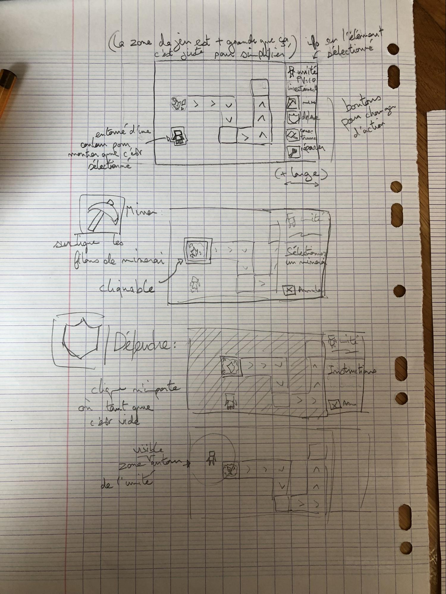
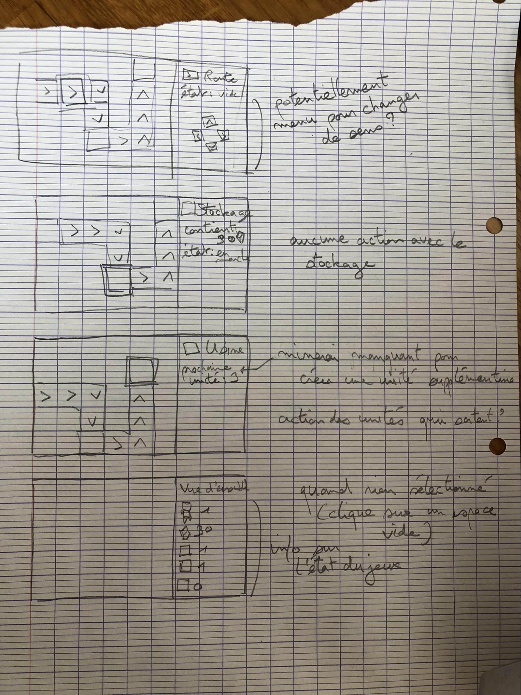
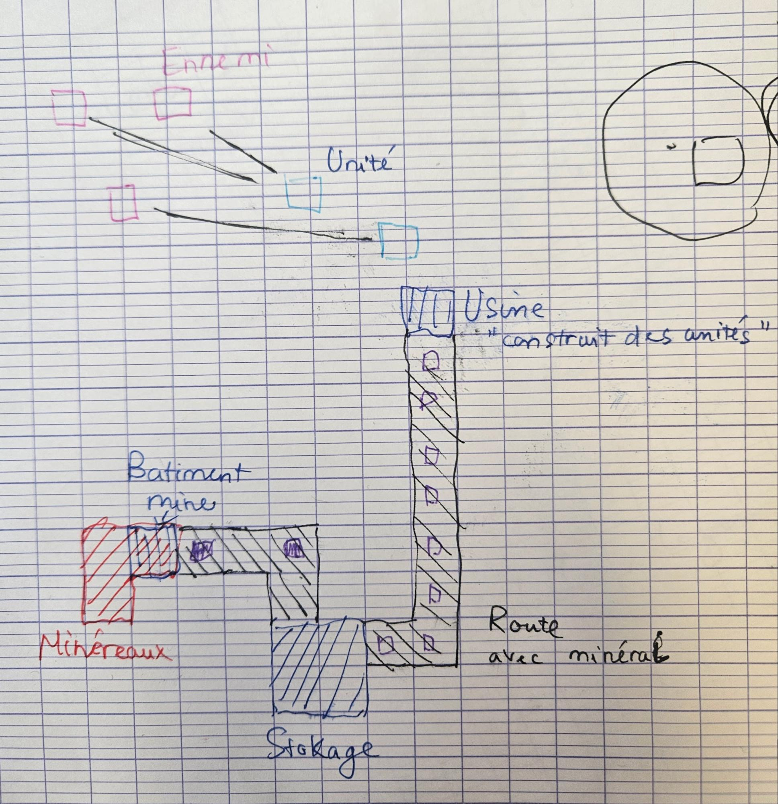
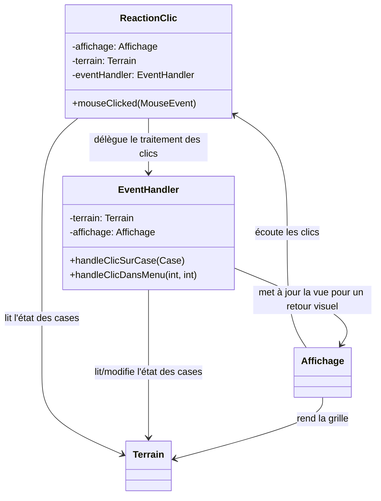

# Projet PCII

Noé BRIAND, Thanh Phat DOAN, Emilie FESQUET

## 1\. Cahier des Charges

Le but du projet est de créer un jeu de stratégie solo en temps réel, inspiré de Factorio et Mindustry. Le but du jeu est de récolter des ressources parsemées dans la map du jeu, et de construire des bâtiments et des unités pour automatiser et accélérer la récolte de minerai (il n'y a donc pas de fin).

Le joueur commence avec un bâtiment maître et une seule unité qu'il peut diriger pour récolter du minerai. Il peut ensuite construire des mines pour récolter automatiquement, des routes pour acheminer les minerais, des bâtiments de stockage pour y mettre des ressources et des usines pour construire de nouvelles unités.

Le bâtiment maître sert initialement de stockage. Comme les autres bâtiments de stockage, il a une capacité limitée. S'il est détruit, le joueur perd la partie.

Des vagues d'ennemis arrivent régulièrement, et peuvent détruire les routes, bâtiments et unités.
Les ennemis apparaissent en bordure de la carte et se déplacent en ligne droite vers le bâtiment maître. Si un bâtiment ou une unité est dans une zone autour de lui, il la détruit puis continue son chemin. S'il arrive vers une unité en mode défense, il meurt et disparaît.

On peut ordonner aux unités de récolter du matériel, de construire des routes ou des bâtiments, ou de défendre les bâtiments existants. Les unités en mode défense se comportent comme des tourelles, et détruisent les ennemis qui entrent dans un périmètre autour d'elles.
Chaque unité a un stockage local qu'elle peut utiliser pour commencer à construire des routes/bâtiments.

Visuellement, les bâtiments et minerais sont sur une grille. Les unités et les ennemis se déplacent de manière continue (ne suivent pas la grille).

Chaque case "route" possède une direction. Lorsqu'un minerai arrive sur sa case, elle le déplace dans cette direction uniquement si la case suivante est une route opérationnelle (pas cassée) qui ne contient pas de minerai, ou un bâtiment. Sinon, le minerai ne bouge pas.
Si une route est détruite, seulement la case qui a été visée est détruite. Les minerais qui étaient en train d'être acheminés continuent leur chemin si possible.
Le joueur décide lui-même la direction des routes pour avoir le contrôle complet sur l'acheminement des minerais, et pouvoir faire éventuellement des chemins plus complexes (ex: relier plusieurs chemins entre eux).

## Prototypes visuels





## 2\. Analyse

Cette section présente les principales fonctionnalités à développer pour le projet ainsi que leur niveau de difficulté et leur priorité.

## 2.1 Analyse globale

Les principales fonctionnalités identifiées sont les suivantes :

* Gestion des coordonnées (grille discrète vs mouvement continu)
* Affichage des objets (unités, minerai, bâtiments)
* Gestion des actions des bâtiments (routes, usine, stockage, mine)
* Création, déplacements et actions des ennemis
* Génération du terrain en début de partie
* Actions et déplacements des unités
* Menus et interface utilisateur

Ces fonctionnalités seront détaillées dans la section suivante sous forme de sous-fonctionnalités, accompagnées d'une estimation du temps de développement, du niveau de difficulté et de la priorité.
La priorité est évaluée sur une échelle de 1 à 5, où 1 correspond à une fonctionnalité essentielle à implémenter en premier et 5 à une fonctionnalité secondaire ou optionnelle.

## 2.2. Analyse détaillée

**2.2.1. Gestion des coordonnées (grille discrète vs mouvement continu)** \- 1h45
Cette fonctionnalité constitue la base du système de déplacement et de collision entre les différents objets du jeu.

1. **Gestion des collisions entre ennemis/unités et bâtiments**
    — Difficulté : Moyenne
    — Priorité : 2
    — Temps estimé : 1h
2. **Coordonnées sur la grille (bâtiments et minerais)**
    — Difficulté : Facile
    — Priorité : 1
    — Temps estimé : 30 min
3. **Coordonnées des unités et ennemis (mouvement continu)**
    — Difficulté : Facile
    — Priorité : 1
    — Temps estimé : 15 min

**2.2.2. Affichage des objets (unités, minerai, bâtiments)** \- 2h30
L'affichage graphique permet une visualisation claire du terrain et des entités présentes.

1. **Fenêtre principale avec grille de jeu**
   — Difficulté : Facile
   — Priorité : 1
   — Temps estimé : 45 min

2. **Affichage des unités**
    — Difficulté : Facile
    — Priorité : 2
    — Temps estimé : 15 min

3. **Affichage des filons de minerai et des bâtiments**
    — Difficulté : Moyenne
    — Priorité : 2
    — Temps estimé : 30 min

4. **Animation du minerai sur les routes (effet visuel)**
    — Difficulté : Moyenne
    — Priorité : 5
    — Temps estimé : 1h

**2.2.3. Gestion des bâtiments (usine, stockage, mine, routes)** \- 3h15
Les bâtiments forment l'infrastructure principale permettant l'extraction, le stockage, la transformation et l'acheminement des ressources.

1. **Usine**
    — Difficulté : Moyenne
    — Priorité : 3
    — Temps estimé : 45 min

2. **Stockage des minerais**
    — Difficulté : Facile
    — Priorité : 2
    — Temps estimé : 30 min

3. **Mine (stockage temporaire des minerais collectés)**
    — Difficulté : Moyenne
    — Priorité : 2
    — Temps estimé : 45 min

4. **Déplacement des minerais via routes**
    — Difficulté : Moyenne
    — Priorité : 5
    — Temps estimé : 1h15

**2.2.4. Création, déplacements et actions des ennemis** \- 3h45
Les ennemis constituent un élément de pression continue qui oblige le joueur à organiser simultanément la défense et l'optimisation de la production.

1. **Génération automatique des ennemis par vagues**
    — Difficulté : Moyenne
    — Priorité : 4
    — Temps estimé : 1h

2. **Déplacement des ennemis vers le bâtiment maître**
    — Difficulté : Moyenne
    — Priorité : 4
    — Temps estimé : 45 min

3. **Actions des ennemis (destruction des bâtiments et unités à portée)**
    — Difficulté : Élevée
    — Priorité : 4
    — Temps estimé : 1h30

4. **Mort des ennemis au contact des unités de défense**
    — Difficulté : Moyenne
    — Priorité : 4
    — Temps estimé : 30 min

**2.2.5. Génération du terrain en début de partie** \- 1h
La génération du terrain établit l'état initial du jeu en positionnant les ressources, les bâtiments de départ et les unités sur la grille.

1. **Génération aléatoire des minerais**
    — Difficulté : Facile
    — Priorité : 2
    — Temps estimé : 30 min

2. **Placement du bâtiment maître**
    — Difficulté : Facile
    — Priorité : 3
    — Temps estimé : 15 min

3. **Création de l'unité de base initiale**
    — Difficulté : Facile
    — Priorité : 2
    — Temps estimé : 15 min

**2.2.6. Actions et déplacements des unités** \- 3h15
Les unités assurent l'exécution des ordres du joueur : récolte du minerai, construction des bâtiments et routes, transport des ressources et défense contre les ennemis.

1. **Miner**
    — Difficulté : Moyenne
    — Priorité : 2
    — Temps estimé : 30 min

2. **Construction de bâtiments**
    — Difficulté : Moyenne
    — Priorité : 3
    — Temps estimé : 30 min

3. **Transport du minerai**
    — Difficulté : Moyenne
    — Priorité : 2
    — Temps estimé : 30 min

4. **Défense (tourelle)**
    — Difficulté : Élevée
    — Priorité : 3
    — Temps estimé : 1h

5. **Attribution d'ordres aux unités**
    — Difficulté : Moyenne
    — Priorité : 2
    — Temps estimé : 45 min

**2.2.7. Menus et interface utilisateur** – 2h15 (+30 min optionnel)
L'interface utilisateur permet d'afficher les informations relatives aux ressources et aux bâtiments, ainsi que de commander les actions des unités de manière interactive.

1. **Menu pour les unités**
    — Difficulté : Moyenne
    — Priorité : 2
    — Temps estimé : 1h30

2. **Menu des bâtiments (affichage des quantités de minerai)**
    — Difficulté : Moyenne
    — Priorité : 3
    — Temps estimé : 30 min

3. **Vue d'ensemble des données (minerais, unités, bâtiments) (optionnel)**
    — Difficulté : Faible
    — Priorité : 5
    — Temps estimé : 30 min

## 3\. Plan de développement

Le projet est réalisé par un groupe de trois et représente un volume de travail total estimé à environ **75 heures**, incluant la planification, le développement et la rédaction du rapport.

Environ **50 heures** sont consacrées au développement des fonctionnalités du jeu, tandis qu'environ **15 heures** sont dédiées à la rédaction du rapport. Les **10 heures restantes** correspondent aux séances de planification et à l'organisation du travail en équipe.

### 3.1 Tâches liées à la gestion du projet

* Conception & cahier des charges : 3 x 2h \= 6 h
* Documentation & diagramme de Gantt : 10 h
* Utilisation et apprentissage de GitHub : 2 h

### 3.2 Répartition du temps par fonctionnalité

* Gestion des coordonnées (grille discrète vs mouvement continu): 1h45
* Affichage des objets (unités, minerai, bâtiments): 2h30
* Gestion des bâtiments (usine, stockage, mine, routes): 3h15
* Création, déplacements et actions des ennemis: 3h45
* Génération du terrain en début de partie: 1h
* Actions et déplacements des unités: 3h15
* Menus et interface utilisateur: 2h15 (+30 min optionnel)

### 3.3 Diagramme de Gantt

L'ensemble des tâches est présenté sous la forme d'un diagramme de Gantt, dont les ressources correspondent aux trois membres du groupe projet. Ce diagramme permet de visualiser la planification temporelle et le suivi de l'avancement du projet.

## 4. Fonctionnalité détaillée

## 4.1 Debut : Foreuse threadée (extraction automatique de minerai)

### Structures de données principales et constantes

- Classe `Foreuse` (hérite de `Batiment`, implémente `Runnable`) : gère l’extraction automatique du minerai.
- Attributs :
  - `DELAI_EXTRACTION` (constante, délai entre deux extractions)
  - `running` (flag d’arrêt du thread)
  - stockage (hérité de `Batiment`, capacité 1)
- Méthodes :
  - `run()` (boucle d’extraction)
  - `arreter()` (arrêt du thread)
  - `ajouterMinerai(int)` (hérité)

### Algorithme abstrait

1. Lorsqu’une foreuse est placée sur une case MINERAI, un thread est lancé (méthode `run`).
2. Tant que le flag `running` est vrai, la foreuse attend `DELAI_EXTRACTION` millisecondes.
3. Si le stockage n’est pas plein, elle ajoute 1 minerai à son stockage (méthode héritée de `Batiment`).
4. Si le stockage est plein, elle attend le prochain cycle.
5. Le thread peut être arrêté proprement via la méthode `arreter()` (flag `running` mis à false).

### Conditions limites à respecter

- Le stockage ne doit jamais dépasser 1 (capacité fixée à la création).
- La foreuse ne doit extraire que si la case contient du minerai.
- Le thread doit pouvoir être arrêté proprement (interruption, flag `running`).
- Les accès concurrents au stockage doivent être sûrs (pas de bug de synchronisation, ici géré par la simplicité du modèle).

### Utilisation par les autres fonctionnalités

- Les routes peuvent venir vider le stockage de la foreuse pour transporter le minerai.
- L’interface peut afficher l’état du stockage en temps réel.
- Les tests automatisés (`ForeuseThreadTest`) vérifient le comportement asynchrone et la synchronisation.

### Diagramme de classes simplifié

```
         +--------------------------+
         |        Foreuse           |
         +--------------------------+
         | - DELAI_EXTRACTION:int   |
         | - running:boolean        |
         |--------------------------|
         | +run()                   |
         | +arreter()               |
         +--------------------------+
                ^
                |
         +-------------------+
         |    Batiment       |
         +-------------------+
         | - stockage:int    |
         | - capacite:int    |
         +-------------------+
         | +ajouterMinerai() |
         | +retirerMinerai() |
         | +estVide()        |
         | +estPlein()       |
         +-------------------+
```

Ce diagramme met en avant la relation d’héritage et les méthodes principales pour la gestion de l’extraction automatique.


## 4.2 Debut: Gestion des clics et contrôleur de l’interface

### Structures de données principales et constantes

**Classe**`ReactionClic` (implémente `MouseListener`) : capte les clics de souris sur la fenêtre et délègue les actions au `EventHandler`.

- Attributs : `affichage` (JPanel avec la grille et le menu), `terrain` (grille de jeu), `eventHandler` (gestionnaire des actions).

- Enum `ClickContext` : distingue les clics sur la **grille** ou le **menu** .

**Classe** `EventHandler` : encapsule la logique du jeu déclenchée par les clics.

- Attribut : 
  
  * `terrain: Terrain` → pour lire/modifier l’état des cases.
  
  * `affichage: Affichage` → pour fournir un *retour visuel immédiat* (par ex. surligner la case sélectionnée, mettre à jour un bouton, etc.).

### Algorithme abstrait

1) `ReactionClic` reçoit un clic `(x, y)` via `mouseClicked`.

2) `getClickContext(x, y)` détermine si le clic est sur la **grille** ou le **menu** et selon l’endroit cliqué , il délègue au `EventHandler`. 

3) `EventHandler`: 
   
   * Lit ou modifie l’état du modèle (`Terrain` / `Case`).
   
   * Met à jour la vue (`Affichage`) pour refléter visuellement le résultat du clic.

### Conditions limites à respecter

- **Grille carrée** : le nombre de cases en largeur = nombre de cases en hauteur.

- **Dimensions de la grille** : largeur et hauteur en pixels = `taille_grille * TAILLE_CASE`.

- **Clics dans la grille** : les coordonnées `(gridX, gridY)` doivent rester dans `[0, taille_grille]`.

- **Menu à droite** : le menu doit commencer exactement après la largeur de la grille (`x > taille_grille`) et ne pas empiéter sur la grille.

- **Coordonnées de clic non négatives** : `x >= 0`, `y >= 0`.

### Diagramme de classes simplifié



# 
