# Projet PCII

Noé BRIAND, Thanh Phat DOAN, Emilie FESQUET

## 1\. Cahier des Charges

Le but du projet est de créer un jeu de stratégie solo en temps réel, inspiré de Factorio et Mindustry. Le but du jeu est de récolter des ressources parsemées dans la map du jeu, et de construire des bâtiments et des unités pour automatiser et accélérer la récolte de minerai (il n'y a donc pas de fin).

Le joueur commence avec un bâtiment maître et une seule unité qu'il peut diriger pour récolter du minerai. Il peut ensuite construire des mines pour récolter automatiquement, des routes pour acheminer les minerais, des bâtiments de stockage pour y mettre des ressources et des usines pour construire de nouvelles unités.

Le bâtiment maître sert initialement de stockage. Comme les autres bâtiments de stockage, il a une capacité limitée. S'il est détruit, le joueur perd la partie.

Des vagues d'ennemis arrivent régulièrement, et peuvent détruire les routes, bâtiments et unités.
Les ennemis apparaissent en bordure de la carte et se déplacent en ligne droite vers le bâtiment maître. Si un bâtiment ou une unité est dans une zone autour de lui, il la détruit puis continue son chemin. S'il arrive vers une unité en mode défense, il meurt et disparaît.

On peut ordonner aux unités de récolter du matériel, de construire des routes ou des bâtiments, ou de défendre les bâtiments existants. Les unités en mode défense se comportent comme des tourelles, et détruisent les ennemis qui entrent dans un périmètre autour d'elles.
Chaque unité a un stockage local qu'elle peut utiliser pour commencer à construire des routes/bâtiments.

Visuellement, les bâtiments et minerais sont sur une grille. Les unités et les ennemis se déplacent de manière continue (ne suivent pas la grille).

Chaque case "route" possède une direction. Lorsqu'un minerai arrive sur sa case, elle le déplace dans cette direction uniquement si la case suivante est une route opérationnelle (pas cassée) qui ne contient pas de minerai, ou un bâtiment. Sinon, le minerai ne bouge pas.
Si une route est détruite, seulement la case qui a été visée est détruite. Les minerais qui étaient en train d'être acheminés continuent leur chemin si possible.
Le joueur décide lui-même la direction des routes pour avoir le contrôle complet sur l'acheminement des minerais, et pouvoir faire éventuellement des chemins plus complexes (ex: relier plusieurs chemins entre eux).

## Prototypes visuels


## 2\. Analyse

Cette section présente les principales fonctionnalités à développer pour le projet ainsi que leur niveau de difficulté et leur priorité.

## 2.1 Analyse globale

Les principales fonctionnalités identifiées sont les suivantes :

* Gestion des coordonnées (grille discrète vs mouvement continu)
* Affichage des objets (unités, minerai, bâtiments)
* Gestion des actions des bâtiments (routes, usine, stockage, mine)
* Création, déplacements et actions des ennemis
* Génération du terrain en début de partie
* Actions et déplacements des unités
* Menus et interface utilisateur

Ces fonctionnalités seront détaillées dans la section suivante sous forme de sous-fonctionnalités, accompagnées d'une estimation du temps de développement, du niveau de difficulté et de la priorité.
La priorité est évaluée sur une échelle de 1 à 5, où 1 correspond à une fonctionnalité essentielle à implémenter en premier et 5 à une fonctionnalité secondaire ou optionnelle.

## 2.2. Analyse détaillée

**2.2.1. Gestion des coordonnées (grille discrète vs mouvement continu)** \- 1h45
Cette fonctionnalité constitue la base du système de déplacement et de collision entre les différents objets du jeu.

1. **Gestion des collisions entre ennemis/unités et bâtiments**
    — Difficulté : Moyenne
    — Priorité : 2
    — Temps estimé : 1h
2. **Coordonnées sur la grille (bâtiments et minerais)**
    — Difficulté : Facile
    — Priorité : 1
    — Temps estimé : 30 min
3. **Coordonnées des unités et ennemis (mouvement continu)**
    — Difficulté : Facile
    — Priorité : 1
    — Temps estimé : 15 min

**2.2.2. Affichage des objets (unités, minerai, bâtiments)** \- 2h30
L'affichage graphique permet une visualisation claire du terrain et des entités présentes.

1. **Fenêtre principale avec grille de jeu**
   — Difficulté : Facile
   — Priorité : 1
   — Temps estimé : 45 min

2. **Affichage des unités**
    — Difficulté : Facile
    — Priorité : 2
    — Temps estimé : 15 min

3. **Affichage des filons de minerai et des bâtiments**
    — Difficulté : Moyenne
    — Priorité : 2
    — Temps estimé : 30 min

4. **Animation du minerai sur les routes (effet visuel)**
    — Difficulté : Moyenne
    — Priorité : 5
    — Temps estimé : 1h

**2.2.3. Gestion des bâtiments (usine, stockage, mine, routes)** \- 3h15
Les bâtiments forment l'infrastructure principale permettant l'extraction, le stockage, la transformation et l'acheminement des ressources.

1. **Usine**
    — Difficulté : Moyenne
    — Priorité : 3
    — Temps estimé : 45 min

2. **Stockage des minerais**
    — Difficulté : Facile
    — Priorité : 2
    — Temps estimé : 30 min

3. **Mine (stockage temporaire des minerais collectés)**
    — Difficulté : Moyenne
    — Priorité : 2
    — Temps estimé : 45 min

4. **Déplacement des minerais via routes**
    — Difficulté : Moyenne
    — Priorité : 5
    — Temps estimé : 1h15

**2.2.4. Création, déplacements et actions des ennemis** \- 3h45
Les ennemis constituent un élément de pression continue qui oblige le joueur à organiser simultanément la défense et l'optimisation de la production.

1. **Génération automatique des ennemis par vagues**
    — Difficulté : Moyenne
    — Priorité : 4
    — Temps estimé : 1h

2. **Déplacement des ennemis vers le bâtiment maître**
    — Difficulté : Moyenne
    — Priorité : 4
    — Temps estimé : 45 min

3. **Actions des ennemis (destruction des bâtiments et unités à portée)**
    — Difficulté : Élevée
    — Priorité : 4
    — Temps estimé : 1h30

4. **Mort des ennemis au contact des unités de défense**
    — Difficulté : Moyenne
    — Priorité : 4
    — Temps estimé : 30 min

**2.2.5. Génération du terrain en début de partie** \- 1h
La génération du terrain établit l'état initial du jeu en positionnant les ressources, les bâtiments de départ et les unités sur la grille.

1. **Génération aléatoire des minerais**
    — Difficulté : Facile
    — Priorité : 2
    — Temps estimé : 30 min

2. **Placement du bâtiment maître**
    — Difficulté : Facile
    — Priorité : 3
    — Temps estimé : 15 min

3. **Création de l'unité de base initiale**
    — Difficulté : Facile
    — Priorité : 2
    — Temps estimé : 15 min

**2.2.6. Actions et déplacements des unités** \- 3h15
Les unités assurent l'exécution des ordres du joueur : récolte du minerai, construction des bâtiments et routes, transport des ressources et défense contre les ennemis.

1. **Miner**
    — Difficulté : Moyenne
    — Priorité : 2
    — Temps estimé : 30 min

2. **Construction de bâtiments**
    — Difficulté : Moyenne
    — Priorité : 3
    — Temps estimé : 30 min

3. **Transport du minerai**
    — Difficulté : Moyenne
    — Priorité : 2
    — Temps estimé : 30 min

4. **Défense**
    — Difficulté : Élevée
    — Priorité : 3
    — Temps estimé : 1h

5. **Attribution d'ordres aux unités**
    — Difficulté : Moyenne
    — Priorité : 2
    — Temps estimé : 45 min

**2.2.7. Menus et interface utilisateur** – 3h15 (+30 min optionnel)
L'interface utilisateur permet d'afficher les informations relatives aux ressources et aux bâtiments, ainsi que de commander les actions des unités de manière interactive.

1. **Gestion des clics de l'utilisateur**
    — Difficulté : Moyenne
    — Priorité : 1
    — Temps estimé : 1h

2. **Menu pour les unités**
    — Difficulté : Moyenne
    — Priorité : 2
    — Temps estimé : 1h30

3. **Menu des bâtiments (affichage des quantités de minerai)**
    — Difficulté : Moyenne
    — Priorité : 3
    — Temps estimé : 30 min

4. **Vue d'ensemble des données (minerais, unités, bâtiments) (optionnel)**
    — Difficulté : Faible
    — Priorité : 5
    — Temps estimé : 30 min

## 3\. Plan de développement

Le projet est réalisé par un groupe de trois et représente un volume de travail total estimé à environ **75 heures**, incluant la planification, le développement et la rédaction du rapport.

Environ **50 heures** sont consacrées au développement des fonctionnalités du jeu, tandis qu'environ **15 heures** sont dédiées à la rédaction du rapport. Les **10 heures restantes** correspondent aux séances de planification et à l'organisation du travail en équipe.

### 3.1 Tâches liées à la gestion du projet

* Conception & cahier des charges : 3 x 2h \= 6 h
* Documentation & diagramme de Gantt : 10 h
* Utilisation et apprentissage de GitHub : 2 h

### 3.2 Répartition du temps par fonctionnalité

* Gestion des coordonnées (grille discrète vs mouvement continu): 1h45
* Affichage des objets (unités, minerai, bâtiments): 2h30
* Gestion des bâtiments (usine, stockage, mine, routes): 3h15
* Création, déplacements et actions des ennemis: 3h45
* Génération du terrain en début de partie: 1h
* Actions et déplacements des unités: 3h15
* Menus et interface utilisateur: 2h15 (+30 min optionnel)

### 3.3 Diagramme de Gantt

L'ensemble des tâches est présenté sous la forme d'un diagramme de Gantt, dont les ressources correspondent aux trois membres du groupe projet. Ce diagramme permet de visualiser la planification temporelle et le suivi de l'avancement du projet.

## 4. Conception générale

Le programme est basé sur une architecture MVC (Modèle Vue Contrôleur).

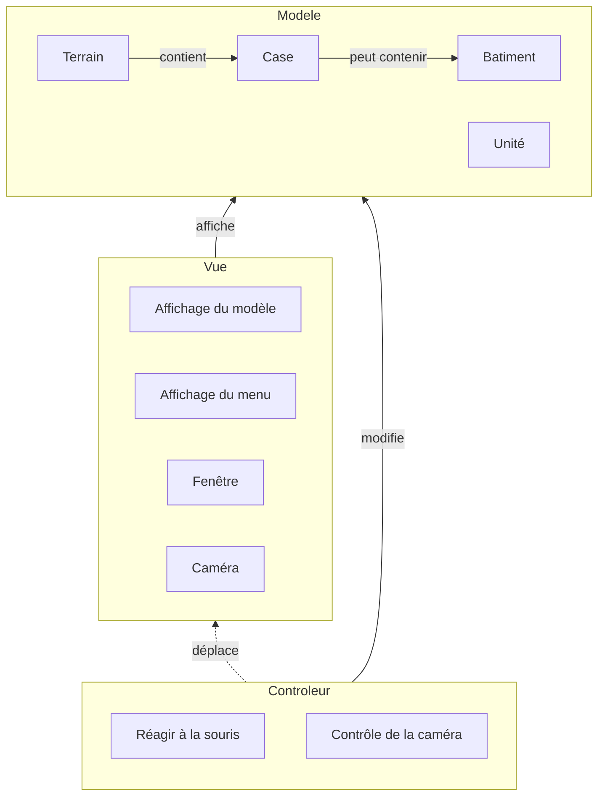
```mermaid
flowchart BT

    subgraph Modele
        direction LR
        Terrain -->|contient| Case
        Case -->|peut contenir| Batiment
        Unité
    end
    subgraph Vue
        direction LR
        AffMod[Affichage du modèle]
        AffMenu[Affichage du menu]
        Fenêtre
        Caméra
    end
    subgraph Controleur
        RC[Réagir à la souris]
        Camera[Contrôle de la caméra]
    end

    Vue -->|affiche| Modele
    Controleur -->|modifie| Modele
    Controleur -.->|déplace| Vue
```


## 5. Conception détaillée

## 5.1 : Gestion des coordonnées (grille discrète vs mouvement continu)

### 5.1.1 : Gestion des collisions entre ennemis/unités et bâtiments

TODO

### 5.1.2 : Coordonnées sur la grille (bâtiments et minerais)

La classe `Case` représente une case de la grille de jeu. Elle contient des coordonnées discrètes (x, y) qui correspondent à sa position sur la grille. Les bâtiments et les minerais sont placés sur ces cases, et leurs coordonnées sont donc alignées avec la grille.

Pour manipuler plus facilement ces coordonnées, on utilise `PositionGrille` sous forme de *record* immuable, ce qui garantit notamment une comparaison correcte par valeur (`equals`/`hashCode`) pour les collections.

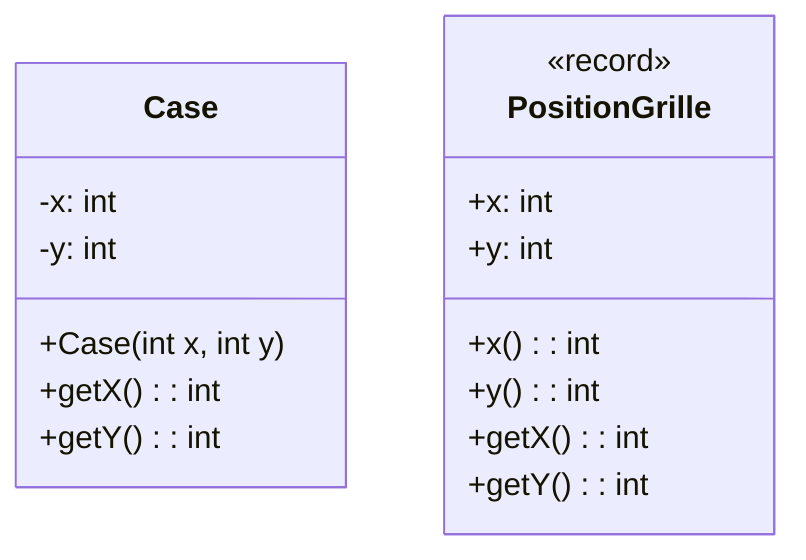
```mermaid
classDiagram
    class Case {
        -x: int
        -y: int
        +Case(int x, int y)
        +getX( ): int
        +getY( ): int
    }
    class PositionGrille {
        <<record>>
        +x: int
        +y: int
        +x( ): int
        +y( ): int
        +getX( ): int
        +getY( ): int
    }
```

### 5.1.3 : Coordonnées des unités et ennemis (mouvement continu)

(TODO a refaire c'est un broiuilon pour aide)

Les unités et les ennemis utilisent des coordonnées continues en pixels pour leur déplacement. La classe `Unite` gère les positions `px` et `py` (pixels) et les convertit en coordonnées de grille (`getGX()`, `getGY()`) pour interagir avec le terrain. Les déplacements sont gérés via des commandes (ex: `CommandeDeplacement`) qui mettent à jour les positions en pixels à chaque tick.

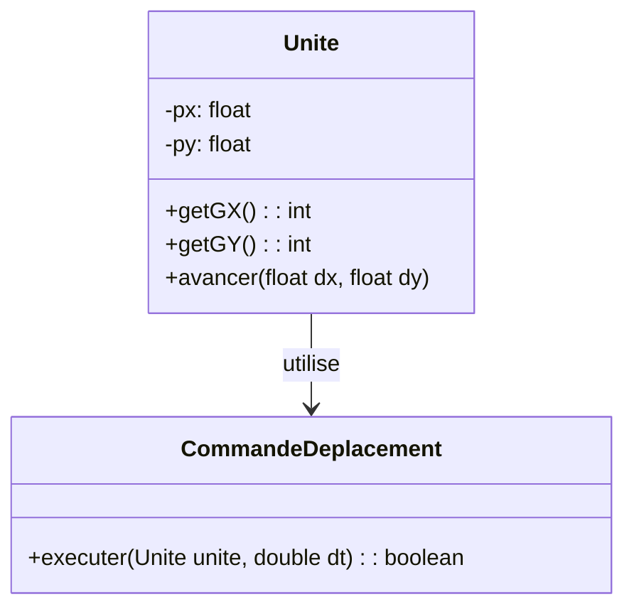
```mermaid
classDiagram
    class Unite {
        -px: float
        -py: float
        +getGX(): int
        +getGY(): int
        +avancer(float dx, float dy)
    }
    class CommandeDeplacement {
        +executer(Unite unite, double dt): boolean
    }
    Unite --> CommandeDeplacement : utilise
```

## 5.2 : Affichage des objets (unités, minerai, bâtiments)

### 5.2.1 : Fenêtre principale avec grille de jeu

- Classe `Fenetre` : classe principale d'affichage, hérite de `JFrame`
  
  - Constructeur `Fenetre(String titre, Terrain terrain)` : initialise la fenêtre, ajoute les composants graphiques nécessaires (comme l'affichage du terrain) et rend la fenêtre visible.

- Classe `Affichage` : responsable de l'affichage du terrain de jeu, hérite de `JPanel`
  
  - Attribut : `terrain` (référence au terrain à afficher)
  - Méthode `paintComponent(Graphics g)` : surcharge pour dessiner les éléments du terrain (minerais, bâtiments, etc.) en fonction de leur position et de leur type. Appelle les fonctions d'affichage spécifiques dans `AffichageMinerais` et `AffichageBâtiments`. Garde un espace pour afficher le menu à droite de la grille.


### 5.2.2 : Affichage des unités

La classe `AffichageUnites` gère l'affichage des unités sur la grille. Chaque unité est dessinée sous forme de cercle centré sur ses coordonnées en pixels. La couleur et la taille sont définies pour distinguer les types d'unités (ex: magenta pour les ouvriers).

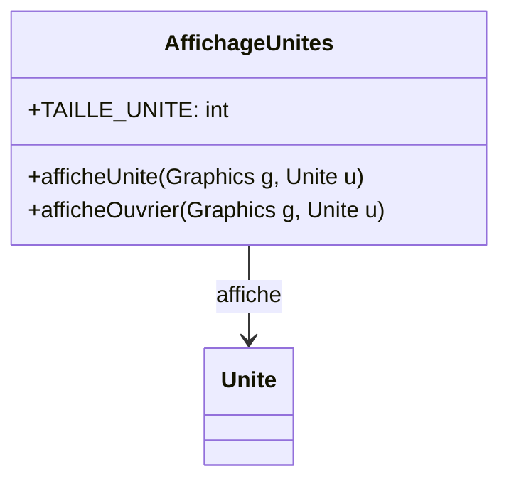
```mermaid
classDiagram
    class AffichageUnites {
        +TAILLE_UNITE: int
        +afficheUnite(Graphics g, Unite u)
        +afficheOuvrier(Graphics g, Unite u)
    }
    AffichageUnites --> Unite : affiche
```


### 5.2.3 : Affichage des filons de minerai et des bâtiments

La classe `AffichageCases` contient des méthodes statiques pour afficher les différents types de cases (vide, minerai, bâtiment) à une position donnée sur la fenêtre. Les images utilisées sont chargées depuis le dossier `./images/`.

- Méthodes statiques :
  - `afficheCase(Graphics g, Case c)` : affiche une case en fonction de son type (vide, minerai, bâtiment) en appelant la méthode d'affichage correspondante.
  - `afficheImageCase(Graphics g, Case c, String adresse)` : affiche l'image à l'emplacement `adresse` sur la case `c`. Récupère l'image dans le cache si on l'a déjà chargée.
  - `afficheImageBatiment(Graphics g, Case c)` : affiche une image correspondant au bâtiment contenu dans la case `c` en appelant la méthode correspondante dans `AffichageBatiments`.

- Variables statiques : 
  - `BASE_ADRESSE_IMAGES` : l'adresse correspondant au dossier `images/` pour l'ordinateur de l'utilisateur.
  - `ADRESSE_MINERAL_DEPOSIT`, `ADRESSE_EN_CONSTRUCTION` : les adresses des sprites utilisés pour l'affichage.


La classe `AffichageBatiments` contient les méthodes et les adresses d'images spécifiques à l'affichage des bâtiments. En plus du type de batiment, l'affichage dépend de la quantité de PV que le bâtiment a, son état de fonctionnement (usine et foreuse), et la quantité de minerai qu'il contient (stockage et batiment maitre). 

- Méthodes statiques :
  - `affiche{nom du batiment}(Graphics g, Case c, {type du batiment} b)` : affiche une image du batiment en question à la position de la case sur la fenêtre.

- Variables statiques :
  - `ADRESSES_{nom du batiment}` : tableau d'adresses des sprites du batiment en question en fonction de son état, et un sprite du bâtiment détruit.
  - `ADRESSES_{nom du batiment}_DAMAGED` : tableau d'adresses des sprites de dégâts du bâtiment en question, à superposer à l'image de base en fonction de la quantité de PV restante du bâtiment.

Les adresse des images utilisées sont stockées dans différentes variables statiques, dans `AffichageBatiments` pour celles spécifiques à chaque batiments et dans `AffichageCases` pour les autres. On utilise un HashMap comme cache afin d'éviter de recharger la même image plusieurs fois.


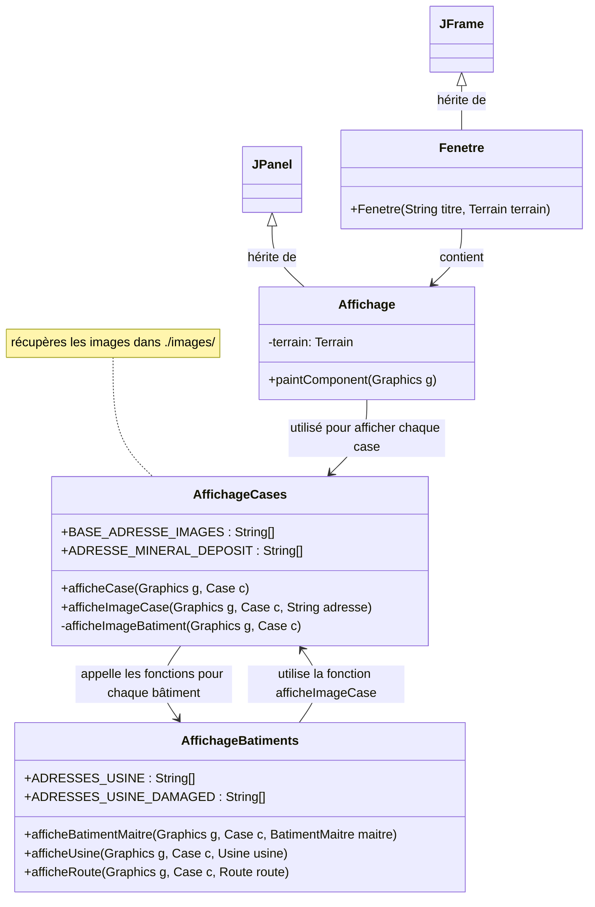
```mermaid
classDiagram

    class Fenetre {
        +Fenetre(String titre, Terrain terrain)
    }

    class Affichage {
        -terrain: Terrain
        +paintComponent(Graphics g)
    }

    class AffichageCases {
        +BASE_ADRESSE_IMAGES : String[]
        +ADRESSE_MINERAL_DEPOSIT : String[]
        +afficheCase(Graphics g, Case c)
        +afficheImageCase(Graphics g, Case c, String adresse)
        -afficheImageBatiment(Graphics g, Case c)
    }

    class AffichageBatiments {
        +ADRESSES_USINE : String[]
        +ADRESSES_USINE_DAMAGED : String[]
        +afficheBatimentMaitre(Graphics g, Case c, BatimentMaitre maitre)
        +afficheUsine(Graphics g, Case c, Usine usine)
        +afficheRoute(Graphics g, Case c, Route route)
    }

    note for AffichageCases "récupères les images dans ./images/"

    JFrame <|-- Fenetre : hérite de
    JPanel <|-- Affichage : hérite de
    Fenetre --> Affichage : contient
    Affichage --> AffichageCases : utilisé pour afficher chaque case
    AffichageCases --> AffichageBatiments : appelle les fonctions pour chaque bâtiment
    AffichageCases <-- AffichageBatiments : utilise la fonction afficheImageCase
```


### 5.2.4 : Animation du minerai sur les routes (effet visuel)

Les minerais en transit sont affichés de manière continue avec la classe `AffichageMinerais`. Chaque minerai utilise une image (`sprite_crystal_centre.png`) qui se déplace fluidement entre les cases de la grille. L'animation utilise des coordonnées en pixels (px, py) pour un rendu visuel fluide, avec interpolation linéaire entre la position de départ et la position cible à chaque étape de progression.

**Caractéristiques :**
- Image : `sprite_crystal_centre.png` (taille réduite à la moitié d'une case)
- Pas de barre de progression jaune (supprimée pour un rendu plus épuré)
- Le minerai disparaît automatiquement lorsqu'il atteint une destination finale (bâtiment maître ou stockage)

La méthode `afficheMinerai(Graphics g, Minerai minerai)` gère l'affichage de chaque minerai en fonction de sa position actuelle et de son état de progression.

## 5.3 : Gestion des bâtiments (usine, stockage, mine, routes)

### 5.3.0 : Destruction des bâtiments

Lorsque l'utilisateur clique sur une case contenant un bâtiment (sauf le bâtiment maître), un bouton "Détruire" apparaît dans le menu d'actions. En cliquant dessus, le bâtiment est retiré de la case correspondante, et l'affichage est mis à jour pour refléter la suppression du bâtiment.

Chaque bâtiment contient une méthode `detruire()` qui gère la logique de destruction (ex: libérer les ressources, mettre à jour l'état de la case, etc.). Le `MenuPanel` appelle la méthode `detruireBatiment()` de la `Case`, qui appelle la méthode `detruire()` sur le bâtiment et met la variable `batiment` à `null`.

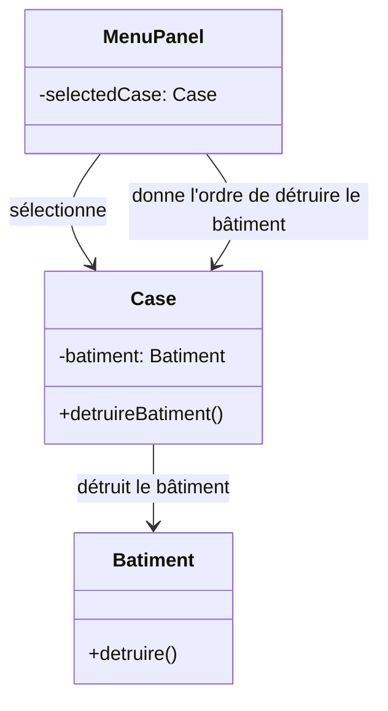
```mermaid
classDiagram
    class MenuPanel {
        -selectedCase: Case
    }

    class Case {
        -batiment: Batiment
        +detruireBatiment()
    }

    class Batiment {
        +detruire()
    }

    MenuPanel --> Case : sélectionne
    Case --> Batiment : détruit le bâtiment
    MenuPanel --> Case : donne l'ordre de détruire le bâtiment
```

### 5.3.5 : Fin de partie (Game Over)

Le jeu se termine automatiquement lorsque le bâtiment maître est détruit (HP atteignant 0). Un écran de Game Over s'affiche alors par-dessus l'interface du jeu sans Fermer l'application.

#### Structures de données et constantes
- **Classe `BatimentMaitre`** : Gère les points de vie du bâtiment principal
  - `HP_MAX`: points de vie maximum (100 par défaut)
  - `isDestroyed()`: méthode héritée de `Batiment` pour vérifier si HP ≤ 0
- **Classe `Fenetre`** : Gère l'affichage de l'écran de fin de partie
  - `gameOver`: booléen indiquant si le jeu est terminé
  - `afficherEcranGameOver()`: affiche un écran semi-transparent rouge avec le message "GAME OVER"
- **Classe `TaskRedessine`** : Détecte la fin de partie et déclenche l'affichage
  - Vérifie à chaque tick si `batimentMaitre.isDestroyed()`
  - Utilise le GlassPane de JFrame pour superposer l'écran de Game Over

#### Algorithme
1. À chaque cycle de rendu (16ms), `TaskRedessine.run()` vérifie l'état du bâtiment maître
2. Si le bâtiment maître est détruit (`isDestroyed() == true`) et que le Game Over n'a pas encore été affiché :
   - Appelle `Fenetre.afficherEcranGameOver()`
   - Marque `gameOverDisplayed = true` pour éviter les affichages multiples
3. L'écran de Game Over utilise le **GlassPane** de Swing pour superposer un panneau semi-transparent rouge par-dessus tout le jeu
4. Le jeu continue de s'exécuter en arrière-plan (les threads ne sont pas arrêtés)

#### Utilisation
- La destruction du bâtiment maître peut être déclenchée par :
  - `batimentMaitre.receiveDamage(X)`: inflige X dégâts au bâtiment
  - `batimentMaitre.detruire()`: détruit immédiatement le bâtiment (met HP à 0)
- L'écran de Game Over est purement visuel et n'affecte pas la logique du jeu

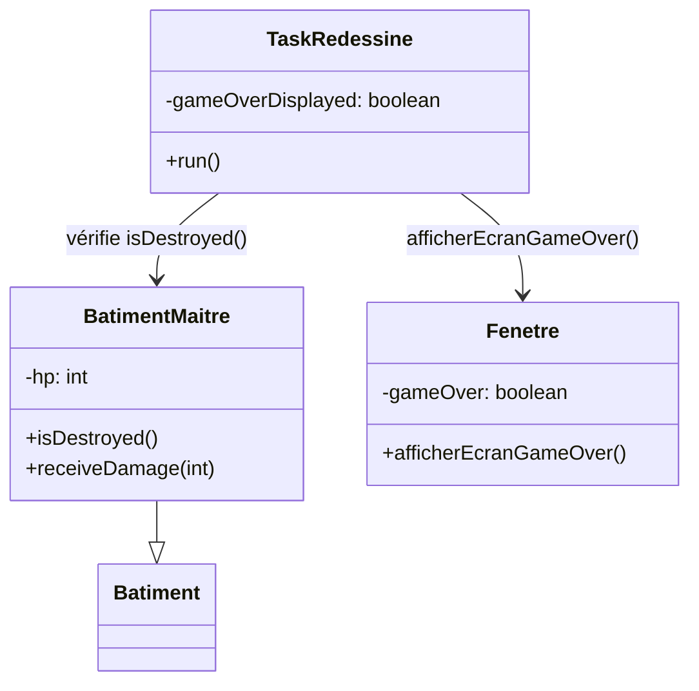
```mermaid
classDiagram
    class BatimentMaitre {
        -hp: int
        +isDestroyed()
        +receiveDamage(int)
    }
    
    class Fenetre {
        -gameOver: boolean
        +afficherEcranGameOver()
    }
    
    class TaskRedessine {
        -gameOverDisplayed: boolean
        +run()
    }
    
    TaskRedessine --> BatimentMaitre : vérifie isDestroyed()
    TaskRedessine --> Fenetre : afficherEcranGameOver()
    BatimentMaitre --|> Batiment
```

### 5.3.1 : Usine

La classe `Usine` produit des unités à partir de minerai. Elle fonctionne en arrière-plan via un thread qui consomme des minerais et crée des unités à intervalles réguliers. L'usine peut être mise en pause ou arrêtée.

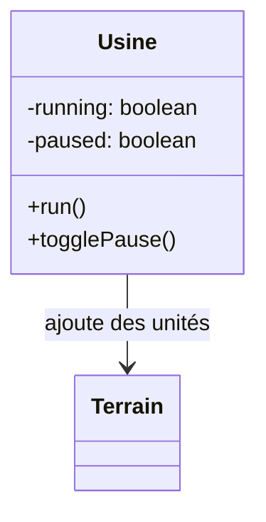
```mermaid
classDiagram
    class Usine {
        -running: boolean
        -paused: boolean
        +run()
        +togglePause()
    }
    Usine --> Terrain : ajoute des unités
```

### 5.3.2 : Stockage des minerais

La classe `Stockage` permet de stocker des minerais avec une capacité fixe. Elle hérite de `Batiment` et gère les opérations d'ajout et de retrait de minerais.

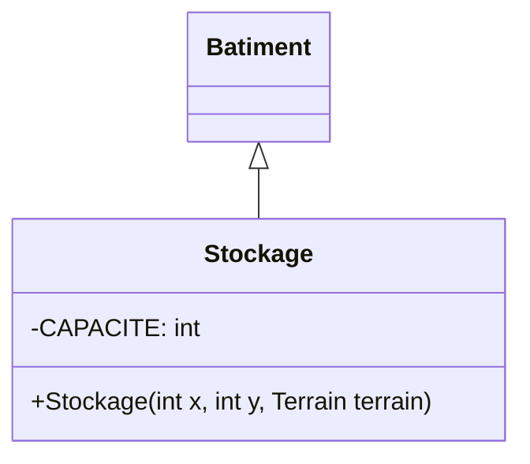
```mermaid
classDiagram
    class Stockage {
        -CAPACITE: int
        +Stockage(int x, int y, Terrain terrain)
    }
    Batiment <|-- Stockage
```

### 5.3.3 : Mine (extraction automatique de minerai via des threads)

#### Structures de données principales et constantes

- Classe `Foreuse` (hérite de `Batiment`, implémente `Runnable`) : gère l’extraction automatique du minerai.
- Classe `Minerai` (implémente `Runnable`) : transporte une unité de minerai le long des routes.
- Classe `AsyncExecutor` : centralise l'exécution asynchrone via un `ExecutorService`.
- Attributs :
  - `DELAI_EXTRACTION` (constante, délai entre deux extractions)
  - `running` (flag d’arrêt du thread)
  - stockage (hérité de `Batiment`, capacité 1)
- Méthodes :
  - `run()` (boucle d’extraction)
  - `arreter()` (arrêt du thread)
  - `ajouterMinerai(int)` (hérité)
    - `AsyncExecutor.runAsync(...)` (lancement centralisé des tâches)

#### Algorithme abstrait

1. Lorsqu’une foreuse est placée sur une case MINERAI, une tâche asynchrone est lancée (méthode `run`).
2. Tant que le flag `running` est vrai, la foreuse attend `DELAI_EXTRACTION` millisecondes.
3. Si le stockage n’est pas plein, elle ajoute 1 minerai à son stockage (méthode héritée de `Batiment`).
4. À chaque extraction, une tâche `Minerai` est lancée via `AsyncExecutor` pour le transport.
5. Si le stockage est plein, elle attend le prochain cycle.
6. Le thread peut être arrêté proprement via la méthode `arreter()` (flag `running` mis à false).

#### Conditions limites à respecter

- Le stockage ne doit jamais dépasser 1 (capacité fixée à la création).
- La foreuse ne doit extraire que si la case contient du minerai.
- Le thread doit pouvoir être arrêté proprement (interruption, flag `running` volatile).
- Les accès concurrents au stockage doivent être sûrs (pas de bug de synchronisation, ici géré par la simplicité du modèle).

#### Utilisation par les autres fonctionnalités

- Les routes peuvent venir vider le stockage de la foreuse pour transporter le minerai.
- L’interface peut afficher l’état du stockage en temps réel.
- Les tests de threads (`ForeuseThreadTest`, `MineraiTest`) vérifient le comportement asynchrone et la synchronisation.

#### Diagramme de classe simplifié

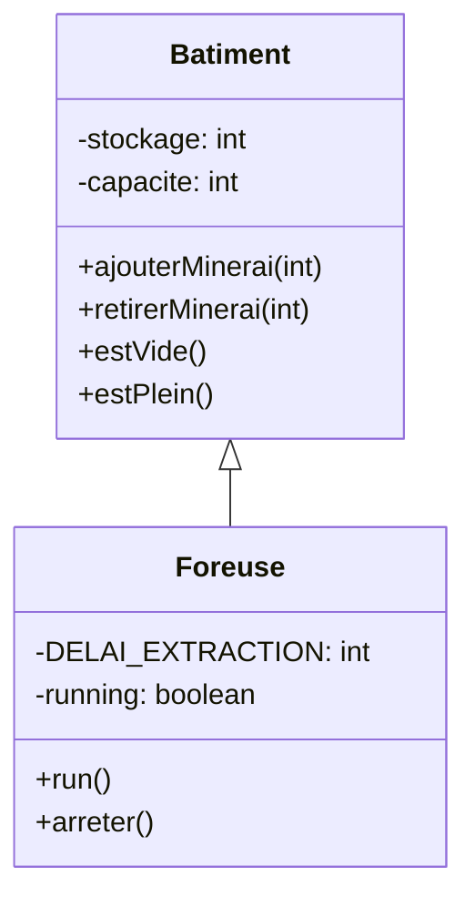
```mermaid
classDiagram
    class Batiment {
        -stockage: int
        -capacite: int
        +ajouterMinerai(int)
        +retirerMinerai(int)
        +estVide()
        +estPlein()
    }

    class Foreuse {
        -DELAI_EXTRACTION: int
        -running: boolean
        +run()
        +arreter()
    }

    Batiment <|-- Foreuse
```

#### Côté Minerai

La classe `Minerai` modélise le transport d'une unité de ressource sur la carte.

- `Minerai` implémente `Runnable`.
- La position courante est stockée via `x` et `y`.
- Le déplacement s'exécute par pas temporels (`DELAI_TRANSPORT`).
- Le drapeau `running` est `volatile` pour permettre un arrêt propre depuis un autre thread.

Le transport est lancé de manière asynchrone par la foreuse via l'exécuteur centralisé, puis le minerai avance case par case jusqu'à atteindre une route valide, le bâtiment maître, ou une condition d'arrêt.

### 5.3.4 : Déplacement des minerais via routes

#### Structures de données principales

- `Minerai` : unité mobile de transport sur la grille.
- `Route` : bâtiment intermédiaire avec direction (`NORD`, `SUD`, `EST`, `OUEST`).
- `BatimentMaitre` : destination finale du minerai.
- `Case` : accès à l'état local (présence d'un bâtiment, type de case).

#### Algorithme abstrait

1. Le minerai démarre sur la position de la foreuse.
2. À chaque cycle, le minerai lit la case courante.
3. Le minerai vérifie d'abord que le bâtiment courant est terminé (`estFini()`). Si ce n'est pas le cas, il attend le cycle suivant.
4. Si la case courante est une route, il calcule la prochaine case selon la direction de la route.
5. Sinon, il recherche la meilleure direction disponible (route/destination finale valide).
6. Si la prochaine case est hors limites, le minerai attend et retente au cycle suivant.
7. La case cible doit contenir un bâtiment terminé (`estFini()`) et avec de la capacité disponible.
8. Si les conditions source/cible sont valides, le minerai est transféré (ajout en cible puis retrait en source, avec rollback en cas d'échec).
9. Si la cible est le bâtiment maître ou un stockage, le transport se termine pour ce minerai.

#### Conditions limites à respecter

- Une route ne peut contenir qu'un seul minerai à la fois.
- Un minerai ne peut se déplacer que depuis/vers des bâtiments dont la construction est terminée (`estFini()`).
- Le retrait du minerai depuis la case précédente doit rester cohérent avec l'ajout sur la case suivante.
- Le déplacement ne doit jamais sortir des bornes de la grille.
- L'arrêt doit être sûr même en contexte concurrent (flag `running` + interruption).
- **Le minerai disparaît visuellement lorsqu'il atteint le bâtiment maître OU un stockage** (modification récente).

#### Complexité

Pour un minerai donné, la complexité temporelle est linéaire par rapport au nombre de cases parcourues jusqu'à la destination ou l'arrêt.

#### Utilisation par les autres fonctionnalités

- Alimente le bâtiment maître en ressources.
- Reflète l'état logistique du réseau de routes.
- Sert de base pour les futures animations visuelles du transport dans la vue.

#### Diagramme de classe simplifié

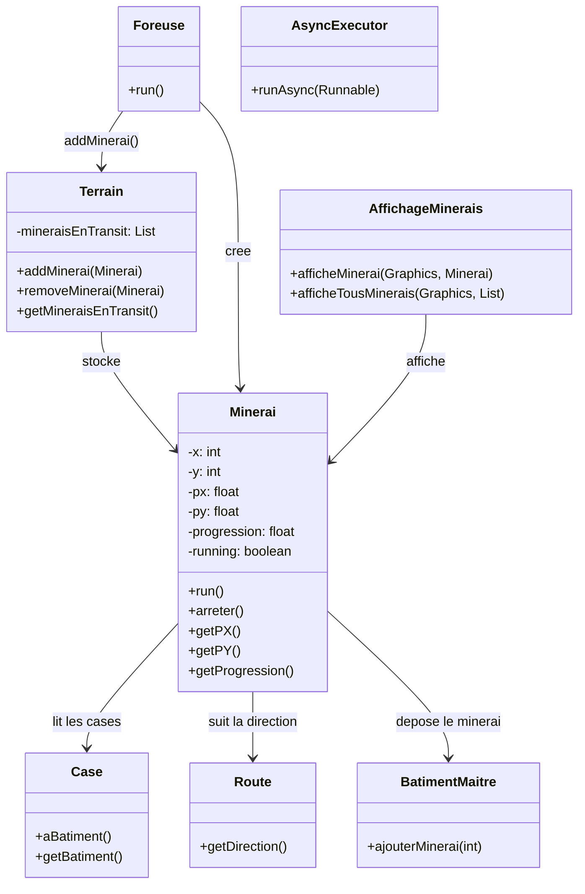
```mermaid
classDiagram
    class Foreuse {
        +run()
    }

    class Minerai {
        -x: int
        -y: int
        -px: float
        -py: float
        -progression: float
        -running: boolean
        +run()
        +arreter()
        +getPX()
        +getPY()
        +getProgression()
    }

    class Route {
        +getDirection()
    }

    class BatimentMaitre {
        +ajouterMinerai(int)
    }

    class Case {
        +aBatiment()
        +getBatiment()
    }

    class Terrain {
        -mineraisEnTransit: List<Minerai>
        +addMinerai(Minerai)
        +removeMinerai(Minerai)
        +getMineraisEnTransit()
    }

    class AsyncExecutor {
        +runAsync(Runnable)
    }

    class AffichageMinerais {
        +afficheMinerai(Graphics, Minerai)
        +afficheTousMinerais(Graphics, List)  
    }

    Foreuse --> Terrain : addMinerai()
    Terrain --> Minerai : stocke
    Foreuse --> Minerai : cree
    Minerai --> Case : lit les cases
    Minerai --> Route : suit la direction
    Minerai --> BatimentMaitre : depose le minerai
    AffichageMinerais --> Minerai : affiche
```

**Implémentation améliorée :**
- Les minerais ont maintenant des coordonnées en **pixels** (`px`, `py`) pour un déplacement fluide
- Une **animation de déplacement** avec interpolation linéaire entre les cases
- Un **indicateur de progression circulaire** s'affiche autour des minerais en mouvement
- La liste `mineraisEnTransit` dans `Terrain` permet à `AffichageTerrain` de tous les afficher

## 5.4 : Création, déplacements et actions des ennemis

### 5.4.0 : Gestion des vagues d'ennemis

Le jeu implémente un système de **vagues d'ennemis** qui attaquent le bâtiment maître à intervalles réguliers.

#### Structures de données et constantes
- **Classe `GestionnaireVagues`** : Gère la génération périodique des vagues d'ennemis
  - `DELAI_ENTRE_VAGUES_MS`: 3 minutes (180 000 ms) entre chaque vague
  - `numeroVague`: compte le nombre de vagues écoulées
  - `tempsRestantMs`: temps restant avant la prochaine vague
- **Classe `Ennemi`** : Représente un ennemi avec :
  - `HP_INITIAL`: 8 points de vie
  - `VITESSE`: 0.25 (vitesse de déplacement)
  - `DEGATS`: 2 (dégâts infligés par attaque)
  - `ATTACK_RANGE`: taille d'une case (portée d'attaque)
- **Classe `VagueInfoPanel`** : Panneau d'interface affichant :
  - Le numéro de la prochaine vague
  - Le compte à rebours (MM:SS)
  - Un bouton "Sauter le temps" pour déclencher manuellement la prochaine vague

#### Algorithme
1. **Initialisation** : Le `GestionnaireVagues` est créée et démarrée dans `Main`
2. **Déclenchement des vagues** : Toutes les 3 minutes, une nouvelle vague est déclenchée
3. **Nombre d'ennemis par vague** : La vague n°N contient N ennemis (vague 1 = 1 ennemi, vague 2 = 2 ennemis, etc.)
4. **Positionnement** : Les ennemis apparaissent aléatoirement sur les bords de la carte (haut, bas, gauche, droite)
5. **Comportement** : Chaque ennemi se déplace vers le bâtiment maître via `CommandeDeplacementEnnemi`
6. **Gestion du cycle de vie** : Les threads des ennemis sont gérés par `AsyncExecutor` via `Terrain.addUnite()`
7. **Affichage du compteur** : Un timer séparé met à jour le temps restant chaque seconde, affiché dans `VagueInfoPanel`
8. **Bouton de saut** : L'utilisateur peut cliquer sur "Sauter le temps" pour déclencher immédiatement la prochaine vague

#### Diagramme de classes
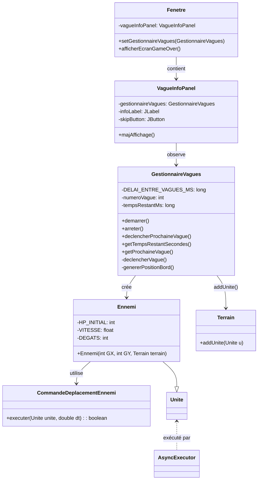
```mermaid
classDiagram
    class GestionnaireVagues {
        -DELAI_ENTRE_VAGUES_MS: long
        -numeroVague: int
        -tempsRestantMs: long
        +demarrer()
        +arreter()
        +declencherProchaineVague()
        +getTempsRestantSecondes()
        +getProchaineVague()
        -declencherVague()
        -genererPositionBord()
    }
    
    class Ennemi {
        -HP_INITIAL: int
        -VITESSE: float
        -DEGATS: int
        +Ennemi(int GX, int GY, Terrain terrain)
    }
    
    class Terrain {
        +addUnite(Unite u)
    }
    
    class CommandeDeplacementEnnemi {
        +executer(Unite unite, double dt): boolean
    }
    
    class VagueInfoPanel {
        -gestionnaireVagues: GestionnaireVagues
        -infoLabel: JLabel
        -skipButton: JButton
        +majAffichage()
    }
    
    class Fenetre {
        -vagueInfoPanel: VagueInfoPanel
        +setGestionnaireVagues(GestionnaireVagues)
        +afficherEcranGameOver()
    }
    
    GestionnaireVagues --> Terrain : addUnite()
    GestionnaireVagues --> Ennemi : crée
    Ennemi --> CommandeDeplacementEnnemi : utilise
    Ennemi --|> Unite
    Unite <.. AsyncExecutor : exécuté par
    Fenetre --> VagueInfoPanel : contient
    VagueInfoPanel --> GestionnaireVagues : observe
```

### 5.4.1 : Génération automatique des ennemis par vagues

Les ennemis sont générés automatiquement par le `GestionnaireVagues` toutes les 3 minutes. Chaque vague contient un nombre croissant d'ennemis (1 pour la première vague, 2 pour la deuxième, etc.).

### 5.4.2 : Déplacement des ennemis vers le bâtiment maître

Les ennemis se déplacent en ligne droite vers le bâtiment maître en utilisant des coordonnées continues. La classe `CommandeDeplacementEnnemi` calcule la direction et la distance pour ajuster leur position à chaque tick.

### 5.4.3 : Actions des ennemis (destruction des bâtiments et unités à portée)

Les ennemis peuvent détruire les bâtiments et unités à portée. Cette fonctionnalité est partiellement implémentée dans `CommandeDeplacementEnnemi` mais nécessite des améliorations pour gérer les collisions et les dégâts.

### 5.4.4 : Mort des ennemis au contact des unités de défense

Les ennemis meurent au contact des unités de défense. Cette fonctionnalité est prévue mais pas encore implémentée dans le code actuel.

## 5.5 : Génération du terrain en début de partie

### Structures de données principales et constantes

- Classe `Terrain` : représente la grille de jeu, contient les cases et gère la génération du terrain.
- Attributs :
  - `taille` (int) : taille de la grille (ex: 20x20).
  - `cases` (Case[][]) : matrice représentant les cases du terrain.
  - `RATIO_MINERAIS` (double) : pourcentage de cases contenant du minerai (ex: 0.1 pour 10%).
- Méthodes :
  - `Terrain()` : constructeur qui créé le terrain.

### Algorithme abstrait

1. Déterminer le nombre de cases contenant un minerai : `nombreMinerais = (int)(taille * taille * RATIO_MINERAIS)`.
2. Générer une liste contenant `nombreMinerais` positions aléatoires différentes les unes des autres et différentes de la position du bâtiment maître.
3. Pour chaque case dans la matrice `cases`, si sa position est contenue dans la liste on y place une case MINERAI, sinon une case VIDE.
4. Crée un nouveau `BatimentMaitre` et le place au centre de la grille.

### Diagramme de classe

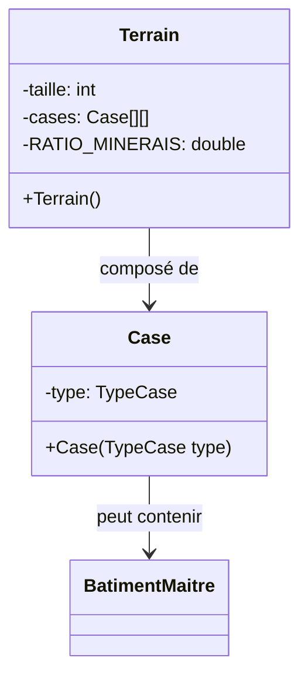
```mermaid
classDiagram
    class Terrain {
        -taille: int
        -cases: Case[][]
        -RATIO_MINERAIS: double
        +Terrain( )
    }
    class Case {
        -type: TypeCase
        +Case(TypeCase type)
    }

    Terrain --> Case : composé de
    Case --> BatimentMaitre : peut contenir
```

### 5.5.3 Création de l'unité de base initiale

TODO

## 5.6 : Actions et déplacements des unités

### 5.6.1 : Miner

La classe `Minerai` modélise le transport d'une unité de ressource sur la carte.

- `Minerai` implémente `Runnable`.
- La position courante est stockée via `x` et `y`.
- Le déplacement s'exécute par pas temporels (`DELAI_TRANSPORT`).
- La **grille** ou le **menu** .


```mermaid
classDiagram
    class Batiment {
        -stockage: int
        -capacite: int
        +ajouterMinerai(int)
        +retirerMinerai(int)
        +estVide()
        +estPlein()
    }

    class Foreuse {
        -DELAI_EXTRACTION: int
        -running: boolean
        +run()
        +arreter()
    }

    Batiment <|-- Foreuse
```

### 5.6.2 : Construction de bâtiments

TEMPORAIRE : à modifier une fois que les unités seront implémentées (actuellement, la construction est gérée directement via le menu).

Lorsque l'utilisateur sélectionne une case ne contenant aucun bâtiment, il peut cliquer sur un bouton pour construire un bâtiment (ex: route, foreuse, etc.).

La classe `ActionsPanel` dans `MenuPanel` affiche les boutons pour la construction de bâtiments. Lorsqu'un bouton est cliqué, elle vérifie d'abord que la case sélectionnée `selectedCase` est constructible (pas de bâtiment déjà présent, type de case compatible).

Si l'utilisateur veut construire une route, un `JOptionPane` s'ouvre pour demander la direction. Ensuite, une instance du bâtiment correspondant (`Route`, `Foreuse`, `Stockage`, `Usine`) est créée et ajoutée à la case cible.

Règle importante : un bâtiment n'est utilisable que lorsqu'il est marqué comme terminé (`estFini() == true`). Tant qu'il n'est pas terminé, les actions qui dépendent de ce bâtiment sont bloquées et réévaluées au cycle suivant. Afin de pouvoir marquer un bâtiment comme terminé, il doit d'abord être construit par une unité.

En mode démonstration, les bâtiments posés par le scénario sont explicitement marqués terminés pour que la simulation démarre immédiatement.

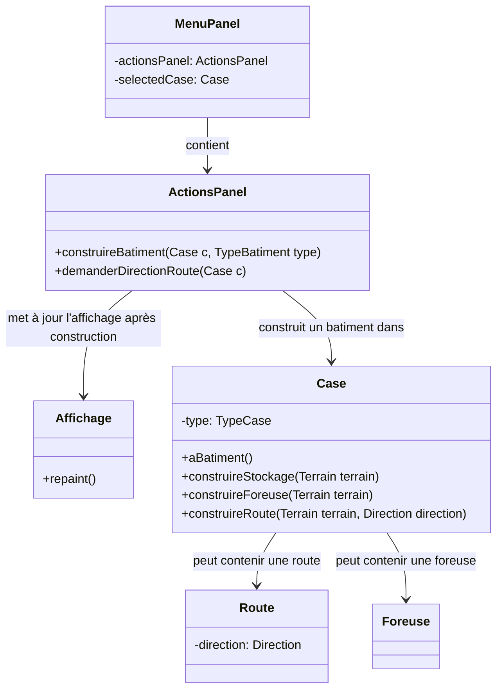
```mermaid
classDiagram
    class MenuPanel {
        -actionsPanel: ActionsPanel
        -selectedCase: Case
    }

    class Affichage {
        +repaint()
    }

    class ActionsPanel {
        +construireBatiment(Case c, TypeBatiment type)
        +demanderDirectionRoute(Case c)
    }

    class Case {
        -type: TypeCase
        +aBatiment()
        +construireStockage(Terrain terrain)
        +construireForeuse(Terrain terrain)
        +construireRoute(Terrain terrain, Direction direction)
    }

    class Route {
        -direction: Direction
    }

    class Foreuse {
    }

    MenuPanel --> ActionsPanel : contient
    ActionsPanel --> Case : construit un batiment dans
    Case --> Route : peut contenir une route
    Case --> Foreuse : peut contenir une foreuse
    ActionsPanel --> Affichage : met à jour l'affichage après construction
```

### 5.6.3 : Transport du minerai

Les unités peuvent transporter du minerai entre les bâtiments. La classe `CommandeDeposit` gère le dépôt de minerai dans le bâtiment maître, tandis que `CommandeMiner` gère la collecte de minerai depuis les gisements.

### 5.6.4 : Défense (tourelle)

Les unités peuvent être mises en mode défense pour protéger les bâtiments. Lorsqu'une unité est en mode défense, elle attaque automatiquement les ennemis à portée. La classe `CommandeDefendre` gère l'activation du mode défense pour une unité.

Lorsqu'une unité est mise en mode défense par le joueur, elle scan toutes les unités présentes sur le terrain avec `scanForEnemies`. La première unité ennemie détectée dans un rayon définit devient sa cible. Tant que la cible est vivante et à portée, l'unité de défense inflige des dégâts à intervalles réguliers. Si la cible est hors de portée, l'unité se déplace pour la rattraper. Si la cible meurt ou qu'aucune n'est détectée, l'unité se replace à l'endroit qu'elle défendait et se remet à chercher une nouvelle cible.

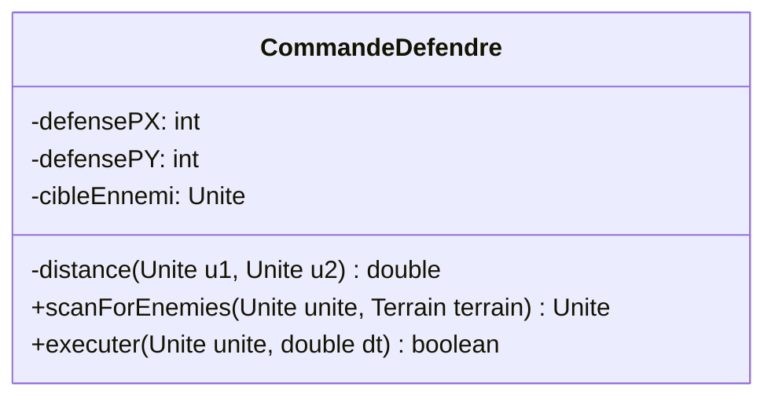
```mermaid
classDiagram
    class CommandeDefendre {
        -defensePX: int
        -defensePY: int
        -cibleEnnemi: Unite
        -distance(Unite u1, Unite u2) double
        +scanForEnemies(Unite unite, Terrain terrain) Unite
        +executer(Unite unite, double dt) boolean
    }
```

### 5.6.5 : Attribution d'ordres aux unités

Les ordres sont attribués aux unités via des commandes (ex: `CommandeMiner`, `CommandeDeplacement`). Ces commandes sont exécutées séquentiellement par l'unité.

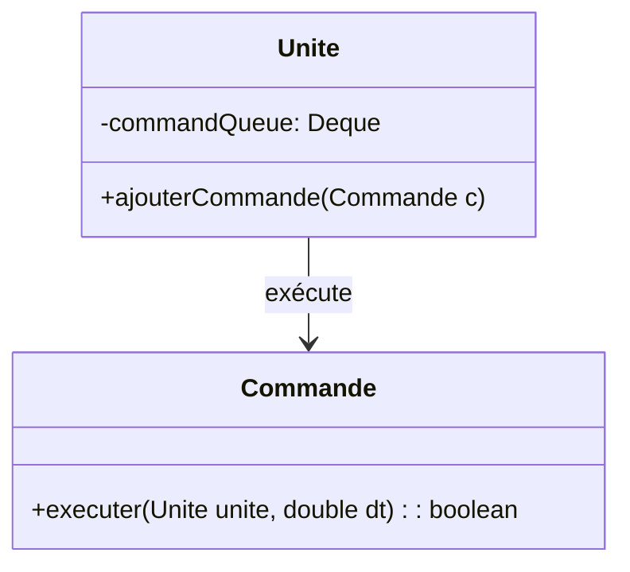
```mermaid
classDiagram
    class Unite {
        -commandQueue: Deque<Commande>
        +ajouterCommande(Commande c)
    }
    class Commande {
        +executer(Unite unite, double dt): boolean
    }
    Unite --> Commande : exécute
```

## 5.7 : Menus et interface utilisateur

### 5.7.1 : Gestion des clics de l'utilisateur

#### Structures de données principales et constantes

La gestion des interactions utilisateur a été regroupée en plusieurs contrôleurs spécialisés, chacun ayant sa propre responsabilité :

- **Classe `CameraController`**  
  Gère les interactions liées au déplacement de la caméra :
  - déplacement via drag souris (clic gauche maintenu)
  - déplacement via clavier (flèches)
  - distinction entre clic et drag grâce à un seuil (`DRAG_THRESHOLD`)
- **Classe `ReactionClic` (implémente `MouseListener`)**  
  Gère les clics utilisateur sur la grille :
  - détecte les clics courts (bouton gauche)
  - ignore les événements si un drag est en cours
  - déclenche l’affichage du menu
- **Classe `ReactionHover` (implémente `MouseMotionListener`)**  
  Gère le survol des cases :
  - met à jour dynamiquement la case survolée
  - permet un retour visuel en temps réel
- **Classe `Camera`**  
  Permet la conversion des coordonnées écran vers la grille :
  - `screenToGridX(int)`
  - `screenToGridY(int)`  
    Ces méthodes prennent en compte le décalage de la caméra (offset).

#### Constantes importantes

- `DRAG_THRESHOLD` : seuil minimal (en pixels) pour considérer un mouvement comme un drag
- `PAN_KEY_SPEED` : vitesse de déplacement de la caméra au clavier

### Algorithme abstrait

#### 1. Gestion du clic (ReactionClic)

1. *Lors d’un événement `mouseReleased` :*
   
   - vérifier que le bouton gauche est utilisé
   - vérifier qu’il ne s’agit pas d’un drag (`cameraController.isDragging()`)

2. *Convertir les coordonnées écran `(x, y)` en coordonnées grille :*
   
   `(gx, gy) = screenToGrid(x, y)`

3. *Vérifier les bornes :*
   
   - si hors de la grille → masquer le menu

4. *Récupérer la case correspondante :*
   
   - si la case contient un bâtiment → afficher le menu
   - sinon → ne rien faire

#### 2. Gestion du drag (CameraController) :

1. `mousePressed` :      
   
   - mémorise la position initiale de la souris
   - mémorise l’offset initial de la caméra

2. `mouseDragged` :
   
   - calcule le déplacement `(dx, dy)`  
   
   - si dépasse `DRAG_THRESHOLD` → activation du mode drag
   
   - met à jour la caméra :
     
     `offset = offset_initial - déplacement_souris`

3. `mouseReleased` :
   
   - désactive le drag

#### 3. Gestion du survol (ReactionHover)

1. À chaque mouvement souris : conversion écran → grille
2. Vérification des bornes : si hors grille → suppression du survol
3. Mise à jour uniquement si la case change : optimisation pour éviter des redessins inutiles

#### 4. Conditions limites à respecter

- Différenciation clic / drag
  Un déplacement léger ne doit pas être interprété comme un drag.

- Conversion correcte des coordonnées
  Les coordonnées doivent toujours prendre en compte l’offset de la caméra.

- Respect des bornes de la grille
  
    0 ≤ gx < taille
    0 ≤ gy < taille

- Focus clavier : nécessaire pour capter les événements clavier `requestFocusInWindow()`

#### Diagramme de classes simplifié

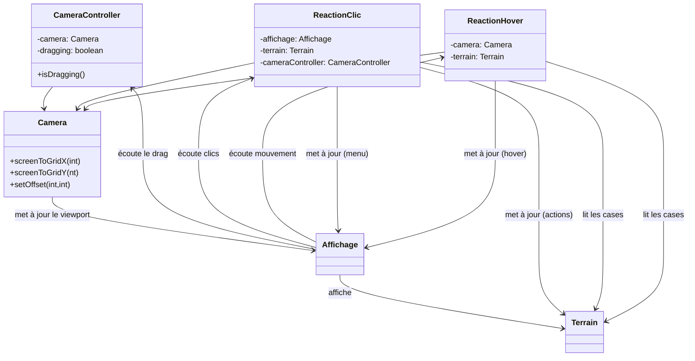
```mermaid
classDiagram
    %% Core
    class Camera {
        +screenToGridX(int)
        +screenToGridY(nt)
        +setOffset(int,int)
    }

    %% Controllers
    class CameraController {
        -camera: Camera
        -dragging: boolean
        +isDragging()
    }

    class ReactionClic {
        -affichage: Affichage
        -terrain: Terrain
        -cameraController: CameraController
    }

    class ReactionHover {
        -camera: Camera
        -terrain: Terrain
    }

    %% Model
    class Terrain {
    }

    %% View
    class Affichage {
    }

    %% Camera dependency
    CameraController --> Camera
    ReactionClic --> Camera
    ReactionHover --> Camera
    Camera --> Affichage : met à jour le viewport

    %% MVC Relationships
    Affichage --> Terrain : affiche
    ReactionClic --> Terrain : met à jour (actions)

    %% Controllers listen to view
    CameraController <-- Affichage : écoute le drag
    ReactionClic <-- Affichage : écoute clics
    ReactionHover <-- Affichage : écoute mouvement

    %% Controllers use model
    ReactionClic --> Terrain : lit les cases
    ReactionHover --> Terrain : lit les cases

    %% Controllers update view
    ReactionClic --> Affichage : met à jour (menu)
    ReactionHover --> Affichage : met à jour (hover)
   
```

Ce diagramme représente l'essentiel de la logique du jeu et suit le patron **MVC** (Model-View-Controller). Le modèle (`Terrain`) contient les données du jeu, la vue (`Affichage`) gère l'affichage en fonction du modèle, et les contrôleur (`ReactionClic` , `ReactionHover `, `CameraController` et `Camera`) gère le modèle tout en mettant également à jour directement la vue pour fournir un retour visuel.

### 5.7.2 : Menu pour les unités

Le `MenuPanel` affiche les actions disponibles pour les unités sélectionnées. Il permet de donner des ordres comme déplacer, miner, construire, ou défendre. Les actions sont gérées via des callbacks définis dans `UnitActionCallback`.

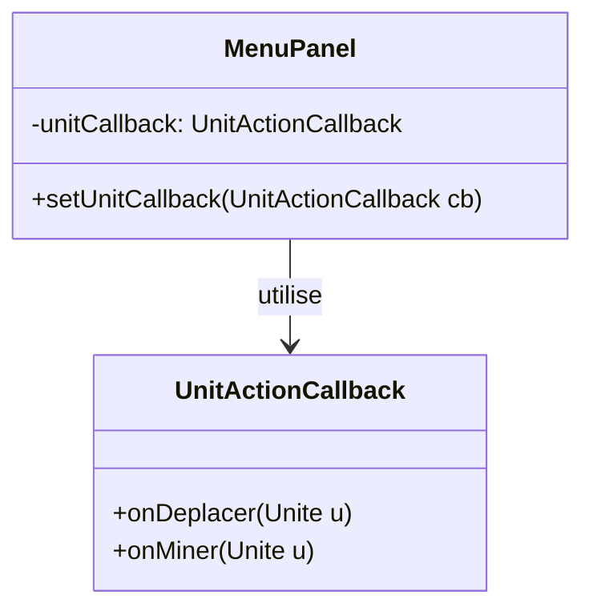
```mermaid
classDiagram
    class MenuPanel {
        -unitCallback: UnitActionCallback
        +setUnitCallback(UnitActionCallback cb)
    }
    class UnitActionCallback {
        +onDeplacer(Unite u)
        +onMiner(Unite u)
    }
    MenuPanel --> UnitActionCallback : utilise
```

### 5.7.3 : Menu des bâtiments (affichage des quantités de minerai)

### Structures de données principales et constantes

- **Classe `MenuPanel`** : panneau principal affiché à droite de l’écran qui contient :
  - `HeaderPanel`
  - `StatsPanel`
  - `ActionsPanel`
- **Classe `StatsPanel`** : responsable de l’affichage des informations du bâtiment:
  - une barre de capacité (`CapacityBar`)
  - des labels pour les valeurs numériques
- **Classe `CapacityBar`**
  - composant graphique personnalisé
  - affiche le ratio de remplissage du stockage

### Algorithme abstrait

#### 1. Affichage du menu

1. Lors d’un clic sur une case contenant un bâtiment :
   - appel à `showMenu(c)`
2. Le menu :
   - devient visible
   - stocke la case sélectionnée
   - déclenche un rafraîchissement (`refresh()`)

#### 2. Construction des statistiques

Si la case sélectionnée change :

- suppression des composants existants
- reconstruction complète de l’interface :
  - création de la barre de capacité
  - création des lignes d’information

#### 3. Mise à jour dynamique (optimisation)

**Si la case sélectionnée reste la même :**

1. Ne pas reconstruire l’interface
2. Mettre à jour uniquement :
   - la barre (`CapacityBar.updateValues`)
   - les labels

 Cela permet d’éviter des recalculs inutiles, des re-layout coûteux et des effets visuels indésirables (en rafraîchissant constamment le menu)

#### 4. Mise à jour de la barre de capacité

1. *Calcul du ratio :*
   
   ratio = stockage / capacité

2. *Choix de la couleur :*
   
   - vert : faible remplissage
   - orange : moyen
   - rouge : proche de la saturation

3. *Redessin uniquement si les valeurs changent*

### Conditions limites à respecter

- **Capacité nulle** :éviter la division par zéro

- **Respect de l’invariant** `stockage ≤ capacité`

- **Performance** : ne pas recréer l’interface à chaque mise à jour (sauf en cas d'absolue nécessité)

- **Cohérence avec les threads** : les valeurs peuvent changer de manière asynchrone (foreuse, transport)

#### Diagramme de classes simplifié

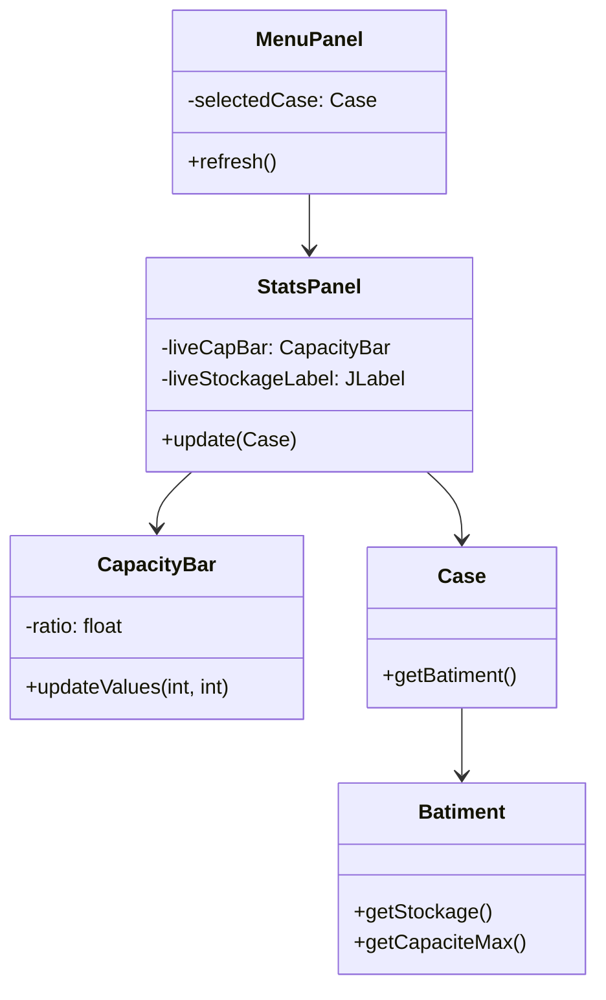
```mermaid
classDiagram

    %%Menu
    class MenuPanel {  
        -selectedCase: Case  
        +refresh()  
    }

    class StatsPanel {  
        -liveCapBar: CapacityBar  
        -liveStockageLabel: JLabel  
        +update(Case)  
    }

    class CapacityBar {  
        -ratio: float  
        +updateValues(int, int)  
    }

    class Case {  
        +getBatiment()  
    }

    class Batiment {  
        +getStockage()  
        +getCapaciteMax()  
    }

MenuPanel --> StatsPanel  
StatsPanel --> CapacityBar  
StatsPanel --> Case  
Case --> Batiment
```

### 5.7.4 : Vue d'ensemble des données (minerais, unités, bâtiments) (optionnel)

Cette fonctionnalité n'a pas été implémentée dans la version actuelle. Cependant, l'interface actuelle permet déjà de visualiser :
- Les bâtiments et leurs états (normal, en construction) via le menu contextuel à droite
- La case sélectionnée avec un encadrement orange
- La case survolée avec un surlignage blanc
- L'écran de Game Over quand le bâtiment maître est détruit

Une future version pourrait inclure un panneau d overview affichant :
- Le nombre total de minerais collectés
- Le nombre d'unités actives
- L'état de tous les bâtiments (HP, production, stockage)

## 6. Résultats

Le projet a permis de développer un jeu de stratégie solo en temps réel avec les fonctionnalités suivantes :
- Gestion des coordonnées pour les bâtiments et les unités.
- Affichage des objets (unités, minerais, bâtiments).
- Gestion des bâtiments (usine, stockage, mine, routes).
- Actions et déplacements des unités (miner, construire, transporter).
- Menus et interface utilisateur pour interagir avec le jeu.

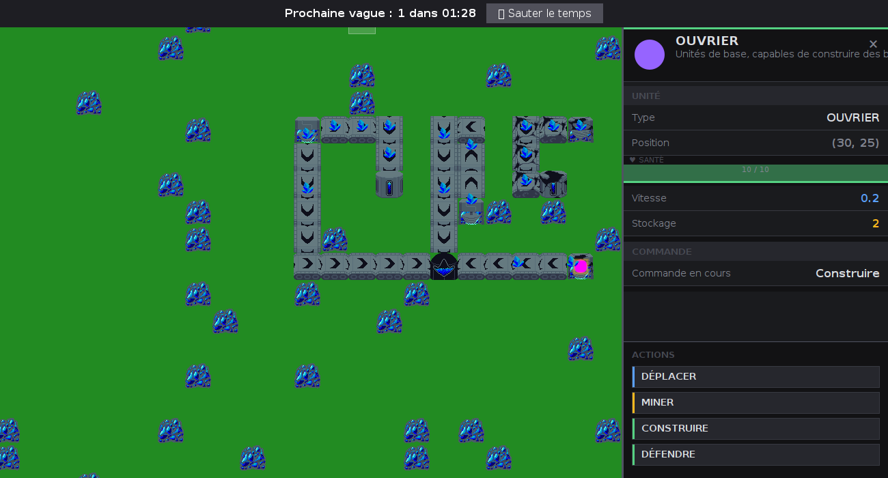
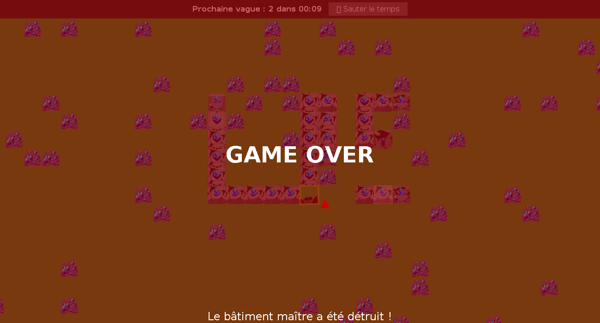

### Validation et Tests

La classe `Validation` permet de valider les arguments et les états du jeu. Elle est configurable via une propriété JVM (`-Dpcii.validation.strict=false`).

Des tests unitaires ont été implémentés pour valider les fonctionnalités critiques :
- `ForeuseThreadTest` : Vérifie que la foreuse extrait correctement du minerai.
- `MineraiTest` : Vérifie le transport du minerai.
- `ReactionClicTest` : Vérifie la gestion des clics utilisateur.
- `TestGameOver` : Teste la fonctionnalité de fin de partie en simulant des attaques sur le bâtiment maître jusqu'à sa destruction et l'affichage de l'écran Game Over.
- Les vagues d'ennemis peuvent être testées en exécutant le jeu principal et en observant le compteur en haut de l'écran. Le bouton "Sauter le temps" permet de tester rapidement plusieurs vagues.

Ces tests garantissent la robustesse du code et facilitent la maintenance.

## 7. Documentation utilisateur

### Prérequis
- Java JDK 17 ou supérieur.
- Un environnement de développement (ex: IntelliJ IDEA, VS Code).

### Installation
1. Cloner le dépôt GitHub.
2. Depuis le répertoire racine, compiler le projet avec la commande :
   ```bash
   javac -d target/classes $(find src -name "*.java")
   ```
3. Exécuter le jeu avec la commande :
   ```bash
   java -cp target/classes main.Main
   ```

### Utilisation

#### **Contrôles de base**
| Action                               | Contrôle                       |
|--------------------------------------|--------------------------------|
| Sélectionner une case/bâtiment/unité | Clic gauche                    |
| Déplacer la caméra                   | Clic gauche + glisser          |
| Zoomer/Dézoomer                      | Molette de la souris ou + et - |
| Ouvrir le menu d'actions             | Clic sur une case sélectionnée |

---

#### **Comment jouer ?**

**1. Récolter du minerai**
- Sélectionnez un **Ouvrier**
- Déplacez-le sur un **filon de minerai** (case grise)
- Cliquez sur **"Miner"** dans le menu
- L'Ouvrier remplit son stockage (max 5 minerais)
- Déplacez-le vers un **Bâtiment Maître** ou **Stockage** et cliquez sur **"Déposer"**

**2. Construire des bâtiments**
- Sélectionnez une **case vide**
- Dans le menu, choisissez un bâtiment :

  **Foreuse** (10 minerais) :
  - **Rôle** : Extraire **automatiquement** du minerai d'un filon
  - **Fonctionnement** :
    - Doit être posée **sur une case avec du minerai** (sinon ne produit rien)
    - Extraire **1 minerai toutes les 2 secondes**
    - **Stockage limité à 1 minerai** → doit être vidée régulièrement
    - **Automatisation** : Connectez-la avec des **Routes** pour acheminer le minerai vers un Stockage ou le Bâtiment Maître
  - **Astuce** : Plus vous avez de Foreuses, plus vous récoltez rapidement !

  - **Route** (1 minerai) : Transport du minerai (choisir une direction ↑↓←→)
  - **Stockage** (10 minerais) : Stocke jusqu'à 10 minerais
  - **Usine** (200 minerais) : Produit des Ouvriers automatiquement

**3. Se défendre**
- Placez un **Ouvrier** près de votre Bâtiment Maître
- Cliquez sur **"Défendre"**
- L'Ouvrier attaquera automatiquement les ennemis à proximité (portée : 2 cases)

---
#### **Astuces**
- **Vagues d'ennemis** : Arrivent toutes les 3 minutes. Utilisez le bouton **"Sauter le temps"** en haut pour tester rapidement.
- **Direction des Routes** : Le minerai suit la flèche. Vérifiez le sens !
- **Bâtiment Maître** : **À protéger absolument** (100 PV). Sa destruction = Game Over.

#### **Conseils supplémentaires**
- Cliquez sur un objet (bâtiment, unité) pour voir ses détails.
- Pour construire un bâtiment, sélectionnez une case vide et choisissez le type de bâtiment dans le menu à droite. Ensuite, sélectionnez une unité et ordonnez-lui de construire le bâtiment.
- Pour défendre une zone, sélectionnez une unité et ordonnez-lui de se mettre en mode défense. Les ennemis à portée seront attaqués automatiquement.
- De manière générale, utilisez le menu à droite pour modifier l'état du jeu (ex: construire, miner, déplacer les unités...).
- Pour zoomer/dézoomer, utilisez la molette de la souris ou les boutons + et -.
- Pour déplacer la caméra, maintenez le clic gauche et déplacez la souris.

## 8. Documentation développeur

### Classes principales
- `Main` : Point d'entrée du jeu.
- `Terrain` : Gère la grille de jeu et les entités.
- `Unite` : Gère les unités et leurs commandes.
- `Batiment` : Classe de base pour tous les bâtiments.
- `MenuPanel` : Gère l'interface utilisateur et les actions.

### Constantes modifiables
- `Foreuse.DELAI_EXTRACTION_MS` : Délai entre deux extractions de minerai.
- `Minerai.DELAI_TRANSPORT_MS` : Délai de transport du minerai.
- `Usine.DELAI_PRODUCTION_MS` : Délai de production des unités.

### Fonctionnalités à implémenter
- **Visuels** : Améliorer les graphismes et l'interface utilisateur pour une meilleure expérience de jeu.
- **Menu de pause/début de jeu** : Ajouter un menu de pause avec des options pour reprendre, redémarrer ou quitter le jeu.
- **Système de sauvegarde** : Permettre aux joueurs de sauvegarder et charger leur progression.

## 9. Conclusion et perspectives

### Réalisation
Nous avons développé un jeu de stratégie solo en temps réel avec une architecture MVC. Les principales fonctionnalités incluent la gestion des bâtiments, des unités, et des ressources, ainsi qu'une interface utilisateur interactive.

### Difficultés et solutions
- **Gestion des threads** : Utilisation de `volatile` et de mécanismes d'interruption pour gérer les threads de manière sécurisée.
- **Synchronisation** : Utilisation de files de commandes pour gérer les actions des unités de manière séquentielle.
- **Affichage** : Utilisation de `Graphics2D` pour dessiner les entités et optimisation des performances avec des caches d'images.

### Apprentissage (TODO a refaire c'est un broiuilon pour aide)
- Maîtrise de la programmation concurrente et des threads en Java.
- Conception d'une architecture MVC pour un jeu.
- Gestion des interactions utilisateur avec Swing.

### Perspectives (TODO a refaire c'est un broiuilon pour aide)
- Ajouter des niveaux de difficulté.
- Implémenter un système de sauvegarde/chargement.
- Améliorer les graphismes et les animations.
- Utiliser des mutex pour éviter les problèmes de synchronisation lorsque plusieurs threads accèdent à des ressources partagées (ex: stockage de la foreuse).