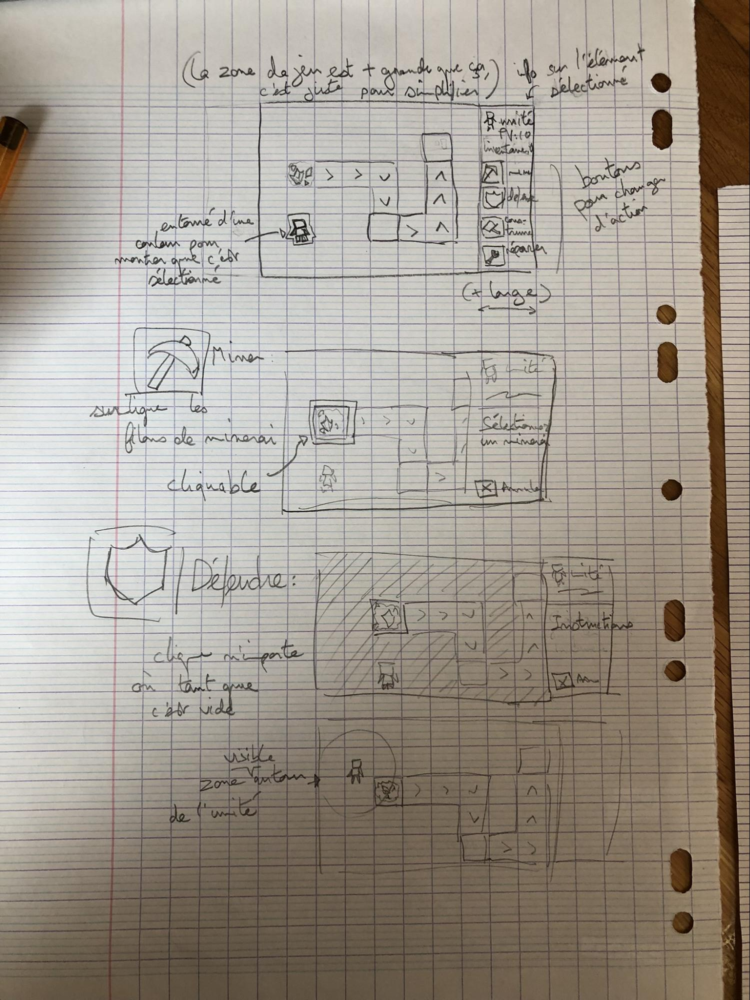
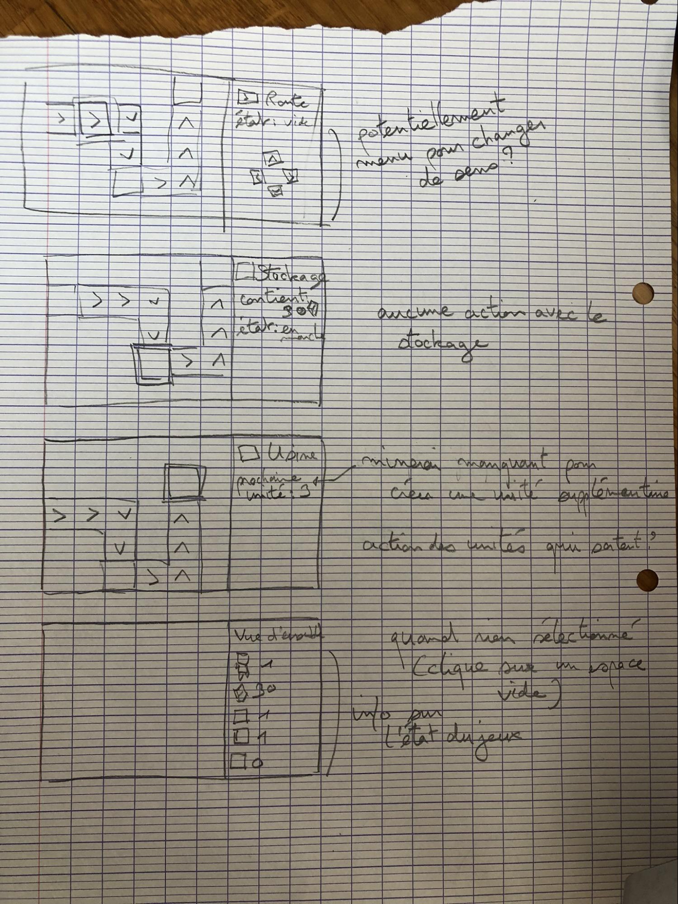
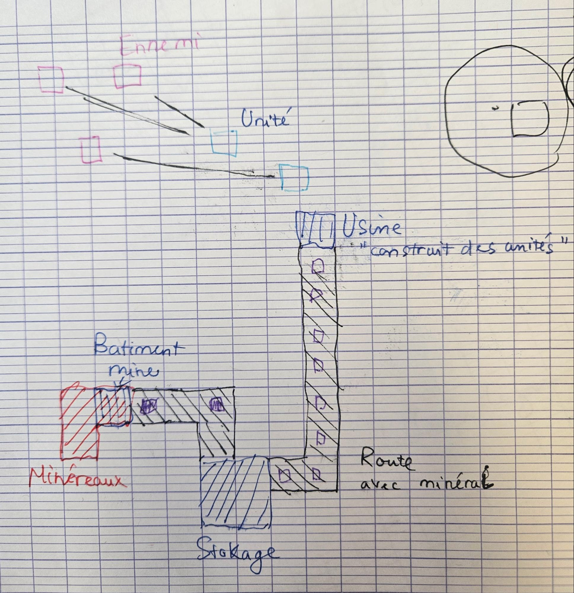
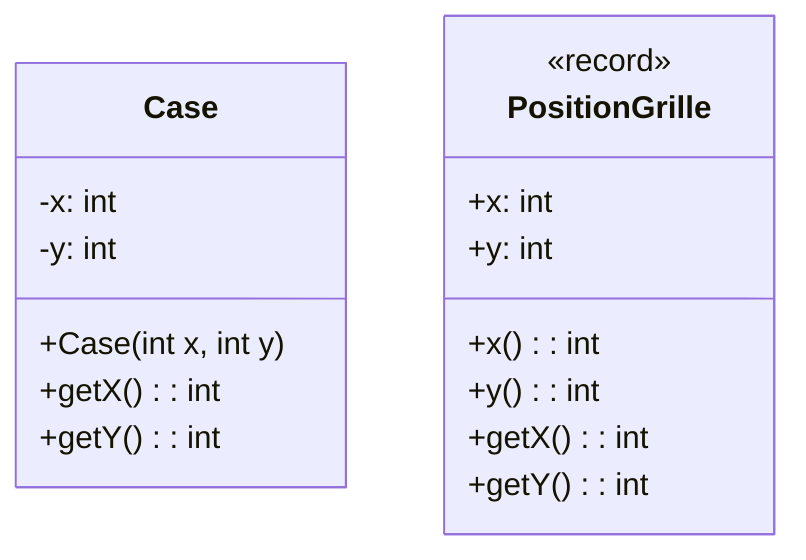
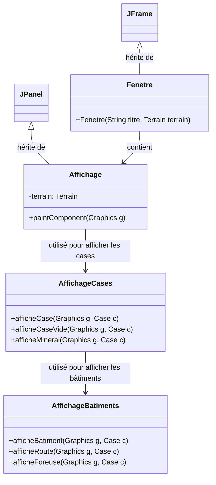
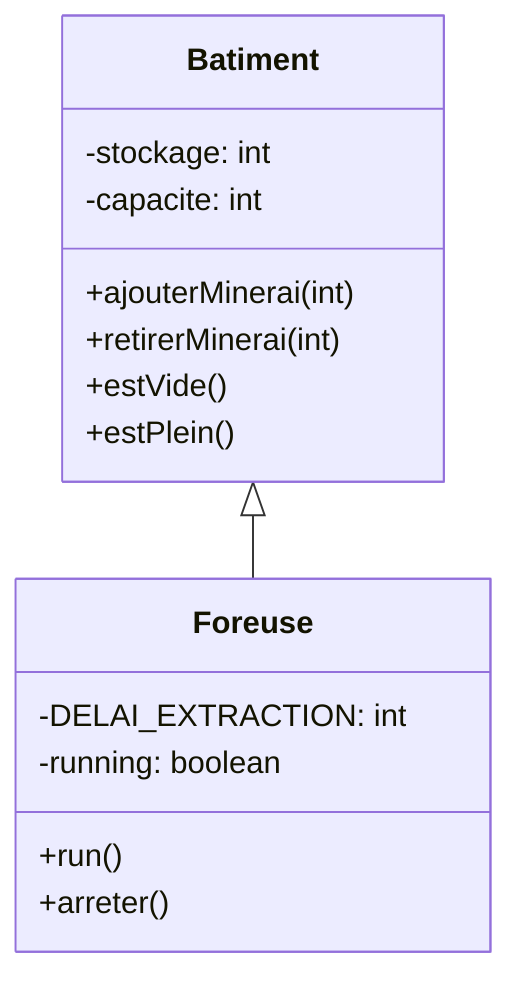
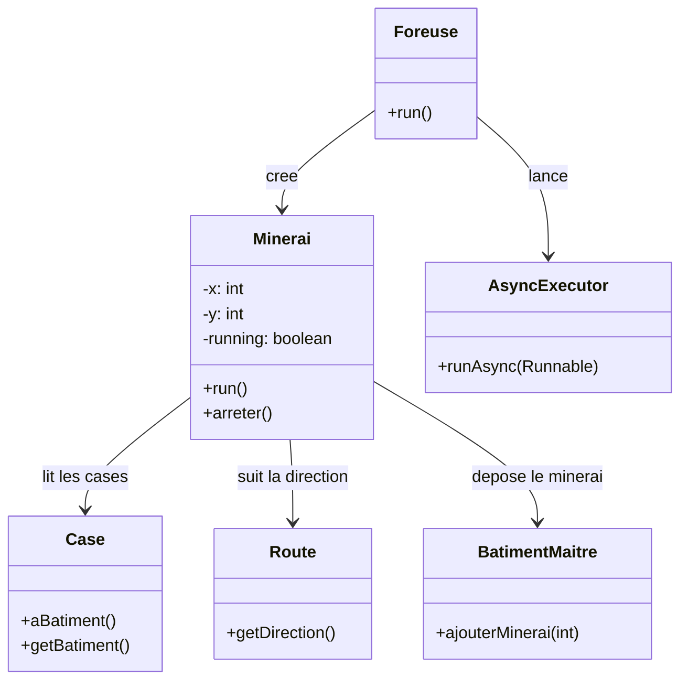
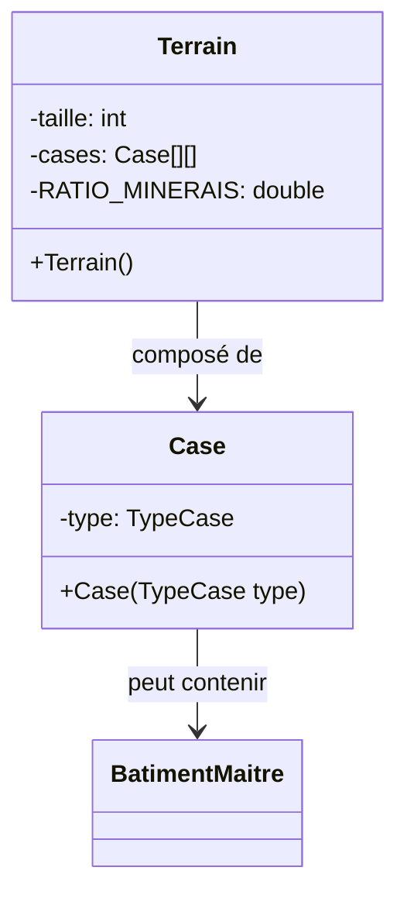
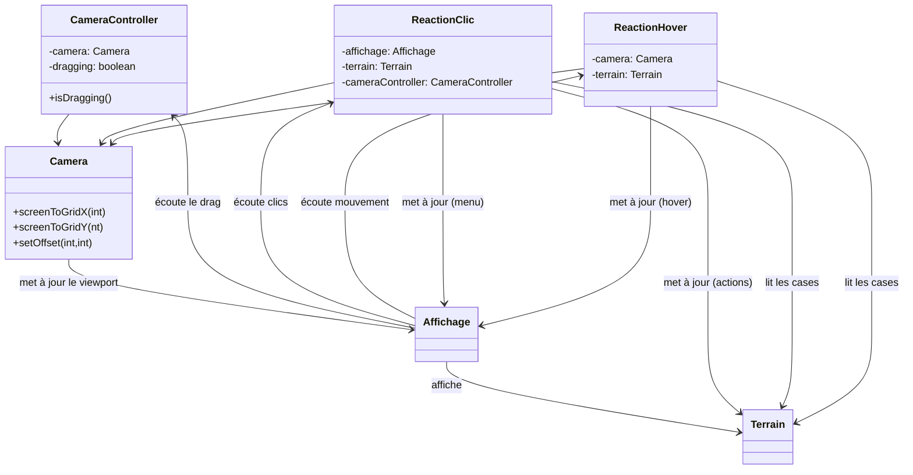
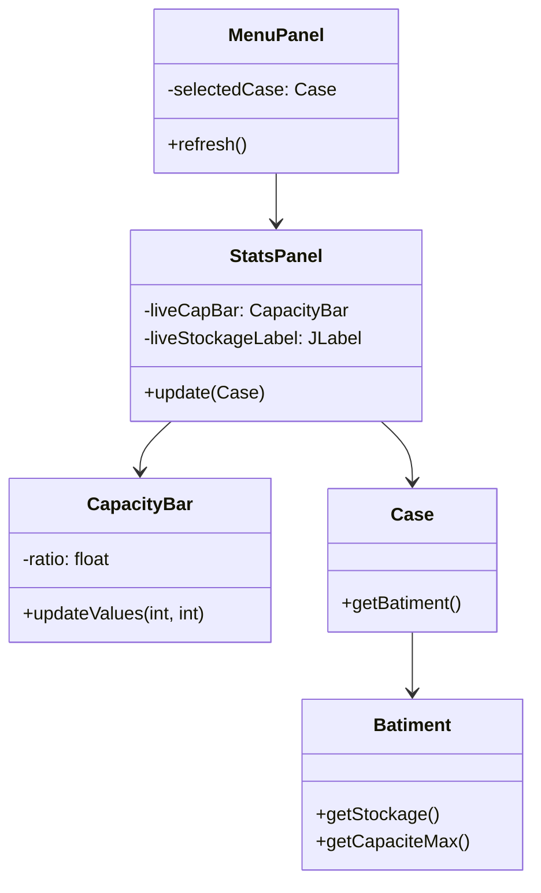

# Projet PCII

Noé BRIAND, Thanh Phat DOAN, Emilie FESQUET

## 1\. Cahier des Charges

Le but du projet est de créer un jeu de stratégie solo en temps réel, inspiré de Factorio et Mindustry. Le but du jeu est de récolter des ressources parsemées dans la map du jeu, et de construire des bâtiments et des unités pour automatiser et accélérer la récolte de minerai (il n'y a donc pas de fin).

Le joueur commence avec un bâtiment maître et une seule unité qu'il peut diriger pour récolter du minerai. Il peut ensuite construire des mines pour récolter automatiquement, des routes pour acheminer les minerais, des bâtiments de stockage pour y mettre des ressources et des usines pour construire de nouvelles unités.

Le bâtiment maître sert initialement de stockage. Comme les autres bâtiments de stockage, il a une capacité limitée. S'il est détruit, le joueur perd la partie.

Des vagues d'ennemis arrivent régulièrement, et peuvent détruire les routes, bâtiments et unités.
Les ennemis apparaissent en bordure de la carte et se déplacent en ligne droite vers le bâtiment maître. Si un bâtiment ou une unité est dans une zone autour de lui, il la détruit puis continue son chemin. S'il arrive vers une unité en mode défense, il meurt et disparaît.

On peut ordonner aux unités de récolter du matériel, de construire des routes ou des bâtiments, ou de défendre les bâtiments existants. Les unités en mode défense se comportent comme des tourelles, et détruisent les ennemis qui entrent dans un périmètre autour d'elles.
Chaque unité a un stockage local qu'elle peut utiliser pour commencer à construire des routes/bâtiments.

Visuellement, les bâtiments et minerais sont sur une grille. Les unités et les ennemis se déplacent de manière continue (ne suivent pas la grille).

Chaque case "route" possède une direction. Lorsqu'un minerai arrive sur sa case, elle le déplace dans cette direction uniquement si la case suivante est une route opérationnelle (pas cassée) qui ne contient pas de minerai, ou un bâtiment. Sinon, le minerai ne bouge pas.
Si une route est détruite, seulement la case qui a été visée est détruite. Les minerais qui étaient en train d'être acheminés continuent leur chemin si possible.
Le joueur décide lui-même la direction des routes pour avoir le contrôle complet sur l'acheminement des minerais, et pouvoir faire éventuellement des chemins plus complexes (ex: relier plusieurs chemins entre eux).

## Prototypes visuels

## 2\. Analyse

Cette section présente les principales fonctionnalités à développer pour le projet ainsi que leur niveau de difficulté et leur priorité.

## 2.1 Analyse globale

Les principales fonctionnalités identifiées sont les suivantes :

* Gestion des coordonnées (grille discrète vs mouvement continu)
* Affichage des objets (unités, minerai, bâtiments)
* Gestion des actions des bâtiments (routes, usine, stockage, mine)
* Création, déplacements et actions des ennemis
* Génération du terrain en début de partie
* Actions et déplacements des unités
* Menus et interface utilisateur

Ces fonctionnalités seront détaillées dans la section suivante sous forme de sous-fonctionnalités, accompagnées d'une estimation du temps de développement, du niveau de difficulté et de la priorité.
La priorité est évaluée sur une échelle de 1 à 5, où 1 correspond à une fonctionnalité essentielle à implémenter en premier et 5 à une fonctionnalité secondaire ou optionnelle.

## 2.2. Analyse détaillée

**2.2.1. Gestion des coordonnées (grille discrète vs mouvement continu)** \- 1h45
Cette fonctionnalité constitue la base du système de déplacement et de collision entre les différents objets du jeu.

1. **Gestion des collisions entre ennemis/unités et bâtiments**
    — Difficulté : Moyenne
    — Priorité : 2
    — Temps estimé : 1h
2. **Coordonnées sur la grille (bâtiments et minerais)**
    — Difficulté : Facile
    — Priorité : 1
    — Temps estimé : 30 min
3. **Coordonnées des unités et ennemis (mouvement continu)**
    — Difficulté : Facile
    — Priorité : 1
    — Temps estimé : 15 min

**2.2.2. Affichage des objets (unités, minerai, bâtiments)** \- 2h30
L'affichage graphique permet une visualisation claire du terrain et des entités présentes.

1. **Fenêtre principale avec grille de jeu**
   — Difficulté : Facile
   — Priorité : 1
   — Temps estimé : 45 min

2. **Affichage des unités**
    — Difficulté : Facile
    — Priorité : 2
    — Temps estimé : 15 min

3. **Affichage des filons de minerai et des bâtiments**
    — Difficulté : Moyenne
    — Priorité : 2
    — Temps estimé : 30 min

4. **Animation du minerai sur les routes (effet visuel)**
    — Difficulté : Moyenne
    — Priorité : 5
    — Temps estimé : 1h

**2.2.3. Gestion des bâtiments (usine, stockage, mine, routes)** \- 3h15
Les bâtiments forment l'infrastructure principale permettant l'extraction, le stockage, la transformation et l'acheminement des ressources.

1. **Usine**
    — Difficulté : Moyenne
    — Priorité : 3
    — Temps estimé : 45 min

2. **Stockage des minerais**
    — Difficulté : Facile
    — Priorité : 2
    — Temps estimé : 30 min

3. **Mine (stockage temporaire des minerais collectés)**
    — Difficulté : Moyenne
    — Priorité : 2
    — Temps estimé : 45 min

4. **Déplacement des minerais via routes**
    — Difficulté : Moyenne
    — Priorité : 5
    — Temps estimé : 1h15

**2.2.4. Création, déplacements et actions des ennemis** \- 3h45
Les ennemis constituent un élément de pression continue qui oblige le joueur à organiser simultanément la défense et l'optimisation de la production.

1. **Génération automatique des ennemis par vagues**
    — Difficulté : Moyenne
    — Priorité : 4
    — Temps estimé : 1h

2. **Déplacement des ennemis vers le bâtiment maître**
    — Difficulté : Moyenne
    — Priorité : 4
    — Temps estimé : 45 min

3. **Actions des ennemis (destruction des bâtiments et unités à portée)**
    — Difficulté : Élevée
    — Priorité : 4
    — Temps estimé : 1h30

4. **Mort des ennemis au contact des unités de défense**
    — Difficulté : Moyenne
    — Priorité : 4
    — Temps estimé : 30 min

**2.2.5. Génération du terrain en début de partie** \- 1h
La génération du terrain établit l'état initial du jeu en positionnant les ressources, les bâtiments de départ et les unités sur la grille.

1. **Génération aléatoire des minerais**
    — Difficulté : Facile
    — Priorité : 2
    — Temps estimé : 30 min

2. **Placement du bâtiment maître**
    — Difficulté : Facile
    — Priorité : 3
    — Temps estimé : 15 min

3. **Création de l'unité de base initiale**
    — Difficulté : Facile
    — Priorité : 2
    — Temps estimé : 15 min

**2.2.6. Actions et déplacements des unités** \- 3h15
Les unités assurent l'exécution des ordres du joueur : récolte du minerai, construction des bâtiments et routes, transport des ressources et défense contre les ennemis.

1. **Miner**
    — Difficulté : Moyenne
    — Priorité : 2
    — Temps estimé : 30 min

2. **Construction de bâtiments**
    — Difficulté : Moyenne
    — Priorité : 3
    — Temps estimé : 30 min

3. **Transport du minerai**
    — Difficulté : Moyenne
    — Priorité : 2
    — Temps estimé : 30 min

4. **Défense (tourelle)**
    — Difficulté : Élevée
    — Priorité : 3
    — Temps estimé : 1h

5. **Attribution d'ordres aux unités**
    — Difficulté : Moyenne
    — Priorité : 2
    — Temps estimé : 45 min

**2.2.7. Menus et interface utilisateur** – 3h15 (+30 min optionnel)
L'interface utilisateur permet d'afficher les informations relatives aux ressources et aux bâtiments, ainsi que de commander les actions des unités de manière interactive.

1. **Gestion des clics de l'utilisateur**
    — Difficulté : Moyenne
    — Priorité : 1
    — Temps estimé : 1h

2. **Menu pour les unités**
    — Difficulté : Moyenne
    — Priorité : 2
    — Temps estimé : 1h30

3. **Menu des bâtiments (affichage des quantités de minerai)**
    — Difficulté : Moyenne
    — Priorité : 3
    — Temps estimé : 30 min

4. **Vue d'ensemble des données (minerais, unités, bâtiments) (optionnel)**
    — Difficulté : Faible
    — Priorité : 5
    — Temps estimé : 30 min

## 3\. Plan de développement

Le projet est réalisé par un groupe de trois et représente un volume de travail total estimé à environ **75 heures**, incluant la planification, le développement et la rédaction du rapport.

Environ **50 heures** sont consacrées au développement des fonctionnalités du jeu, tandis qu'environ **15 heures** sont dédiées à la rédaction du rapport. Les **10 heures restantes** correspondent aux séances de planification et à l'organisation du travail en équipe.

### 3.1 Tâches liées à la gestion du projet

* Conception & cahier des charges : 3 x 2h \= 6 h
* Documentation & diagramme de Gantt : 10 h
* Utilisation et apprentissage de GitHub : 2 h

### 3.2 Répartition du temps par fonctionnalité

* Gestion des coordonnées (grille discrète vs mouvement continu): 1h45
* Affichage des objets (unités, minerai, bâtiments): 2h30
* Gestion des bâtiments (usine, stockage, mine, routes): 3h15
* Création, déplacements et actions des ennemis: 3h45
* Génération du terrain en début de partie: 1h
* Actions et déplacements des unités: 3h15
* Menus et interface utilisateur: 2h15 (+30 min optionnel)

### 3.3 Diagramme de Gantt

L'ensemble des tâches est présenté sous la forme d'un diagramme de Gantt, dont les ressources correspondent aux trois membres du groupe projet. Ce diagramme permet de visualiser la planification temporelle et le suivi de l'avancement du projet.

## 4. Fonctionnalité détaillée

## 4.1 : Gestion des coordonnées (grille discrète vs mouvement continu)

### 4.1.1 : Gestion des collisions entre ennemis/unités et bâtiments

TODO

### 4.1.2 : Coordonnées sur la grille (bâtiments et minerais)

La classe `Case` représente une case de la grille de jeu. Elle contient des coordonnées discrètes (x, y) qui correspondent à sa position sur la grille. Les bâtiments et les minerais sont placés sur ces cases, et leurs coordonnées sont donc alignées avec la grille.

Pour manipuler plus facilement ces coordonnées, on utilise `PositionGrille` sous forme de *record* immuable, ce qui garantit notamment une comparaison correcte par valeur (`equals`/`hashCode`) pour les collections.

```mermaid
classDiagram
    class Case {
        -x: int
        -y: int
        +Case(int x, int y)
        +getX( ): int
        +getY( ): int
    }
    class PositionGrille {
        <<record>>
        +x: int
        +y: int
        +x( ): int
        +y( ): int
        +getX( ): int
        +getY( ): int
    }
```

### 4.1.3 : Coordonnées des unités et ennemis (mouvement continu)

TODO

## 4.2 : Affichage des objets (unités, minerai, bâtiments)

### 4.2.1 : Fenêtre principale avec grille de jeu

- Classe `Fenetre` : classe principale d'affichage, hérite de `JFrame`
  
  - Constructeur `Fenetre(String titre, Terrain terrain)` : initialise la fenêtre, ajoute les composants graphiques nécessaires (comme l'affichage du terrain) et rend la fenêtre visible.

- Classe `Affichage` : responsable de l'affichage du terrain de jeu, hérite de `JPanel`
  
  - Attribut : `terrain` (référence au terrain à afficher)
  - Méthode `paintComponent(Graphics g)` : surcharge pour dessiner les éléments du terrain (minerais, bâtiments, etc.) en fonction de leur position et de leur type. Appelle les fonctions d'affichage spécifiques dans `AffichageMinerais` et `AffichageBâtiments`. Garde un espace pour afficher le menu à droite de la grille.

### 4.2.3 : Affichage des filons de minerai et des bâtiments

La classe `AffichageCases` contient des méthodes statiques pour afficher les différents types de cases (vide, minerai, bâtiment) à une position donnée sur la fenêtre. Chaque méthode prend en paramètre un objet Graphics et une Case pour dessiner l'élément correspondant à la position de la case sur la grille. Les coordonnées de la case sont converties en pixels pour l'affichage, et différentes couleurs sont utilisées pour différencier les types de cases.

Chaque case a sa propre méthode d'affichage, ce qui permet de facilement ajouter de nouveaux types de cases et facilement modifier l'apparence de chaque type de case sans affecter les autres.

- Méthodes statiques :
  - `afficheCase(Graphics g, Case c)` : affiche une case en fonction de son type (vide, minerai, bâtiment) en appelant la méthode d'affichage correspondante.
  - `afficheCaseVide(Graphics g, Case c)` : affiche une case vide à la position de la case sur la fenêtre.
  - `afficheMinerai(Graphics g, Case c)` : affiche un minerai à la position de la case sur la fenêtre.

La classe `AffichageBatiments` contient des méthodes pour afficher les différents types de bâtiments (route, foreuse, etc.) à une position donnée sur la fenêtre. Chaque méthode prendra en paramètre un objet `Graphics` et une `Case` pour dessiner le bâtiment correspondant à la position de la case sur la grille. Ses méthodes sont appelées depuis `AffichageCases` en fonction du contenu de la case à afficher.

- Méthodes statiques :
  - `afficheBatiment(Graphics g, Case c)` : affiche un bâtiment en fonction de son type (route, foreuse, etc.) à la position de la case sur la fenêtre.
  - `afficheRoute(Graphics g, Case c)` : affiche une route à la position de la case sur la fenêtre.
  - `afficheForeuse(Graphics g, Case c)` : affiche une foreuse à la position de la case sur la fenêtre.
  - de même pour les autres types de bâtiments.

```mermaid
classDiagram

    class Fenetre {
        +Fenetre(String titre, Terrain terrain)
    }

    class Affichage {
        -terrain: Terrain
        +paintComponent(Graphics g)
    }

    class AffichageCases {
        +afficheCase(Graphics g, Case c)
        +afficheCaseVide(Graphics g, Case c)
        +afficheMinerai(Graphics g, Case c)
    }

    class AffichageBatiments {
        +afficheBatiment(Graphics g, Case c)
        +afficheRoute(Graphics g, Case c)
        +afficheForeuse(Graphics g, Case c)
    }

    JFrame <|-- Fenetre : hérite de
    JPanel <|-- Affichage : hérite de
    Fenetre --> Affichage : contient
    Affichage --> AffichageCases : utilisé pour afficher les cases
    AffichageCases --> AffichageBatiments : utilisé pour afficher les bâtiments
```

### 4.2.2 : Affichage des unités

TODO

### 4.2.4 : Animation du minerai sur les routes (effet visuel)

TODO

## 4.3 : Gestion des bâtiments (usine, stockage, mine, routes)

### 4.3.1 : Usine

TODO

### 4.3.2 : Stockage des minerais

TODO

### 4.3.3 : Mine (extraction automatique de minerai via des threads)

#### Structures de données principales et constantes

- Classe `Foreuse` (hérite de `Batiment`, implémente `Runnable`) : gère l’extraction automatique du minerai.
- Classe `Minerai` (implémente `Runnable`) : transporte une unité de minerai le long des routes.
- Classe `AsyncExecutor` : centralise l'exécution asynchrone via un `ExecutorService`.
- Attributs :
  - `DELAI_EXTRACTION` (constante, délai entre deux extractions)
  - `running` (flag d’arrêt du thread)
  - stockage (hérité de `Batiment`, capacité 1)
- Méthodes :
  - `run()` (boucle d’extraction)
  - `arreter()` (arrêt du thread)
  - `ajouterMinerai(int)` (hérité)
    - `AsyncExecutor.runAsync(...)` (lancement centralisé des tâches)

#### Algorithme abstrait

1. Lorsqu’une foreuse est placée sur une case MINERAI, une tâche asynchrone est lancée (méthode `run`).
2. Tant que le flag `running` est vrai, la foreuse attend `DELAI_EXTRACTION` millisecondes.
3. Si le stockage n’est pas plein, elle ajoute 1 minerai à son stockage (méthode héritée de `Batiment`).
4. À chaque extraction, une tâche `Minerai` est lancée via `AsyncExecutor` pour le transport.
5. Si le stockage est plein, elle attend le prochain cycle.
6. Le thread peut être arrêté proprement via la méthode `arreter()` (flag `running` mis à false).

#### Conditions limites à respecter

- Le stockage ne doit jamais dépasser 1 (capacité fixée à la création).
- La foreuse ne doit extraire que si la case contient du minerai.
- Le thread doit pouvoir être arrêté proprement (interruption, flag `running` volatile).
- Les accès concurrents au stockage doivent être sûrs (pas de bug de synchronisation, ici géré par la simplicité du modèle).

#### Utilisation par les autres fonctionnalités

- Les routes peuvent venir vider le stockage de la foreuse pour transporter le minerai.
- L’interface peut afficher l’état du stockage en temps réel.
- Les tests de threads (`ForeuseThreadTest`, `MineraiTest`) vérifient le comportement asynchrone et la synchronisation.

#### Diagramme de classe simplifié

```mermaid
classDiagram
    class Batiment {
        -stockage: int
        -capacite: int
        +ajouterMinerai(int)
        +retirerMinerai(int)
        +estVide()
        +estPlein()
    }

    class Foreuse {
        -DELAI_EXTRACTION: int
        -running: boolean
        +run()
        +arreter()
    }

    Batiment <|-- Foreuse
```

Ce diagramme met en avant la relation d’héritage et les méthodes principales pour la gestion de l’extraction automatique.

#### Côté Minerai

La classe `Minerai` modélise le transport d'une unité de ressource sur la carte.

- `Minerai` implémente `Runnable`.
- La position courante est stockée via `x` et `y`.
- Le déplacement s'exécute par pas temporels (`DELAI_TRANSPORT`).
- Le drapeau `running` est `volatile` pour permettre un arrêt propre depuis un autre thread.

Le transport est lancé de manière asynchrone par la foreuse via l'exécuteur centralisé, puis le minerai avance case par case jusqu'à atteindre une route valide, le bâtiment maître, ou une condition d'arrêt.

### 4.3.4 : Déplacement des minerais via routes

#### Structures de données principales

- `Minerai` : unité mobile de transport sur la grille.
- `Route` : bâtiment intermédiaire avec direction (`NORD`, `SUD`, `EST`, `OUEST`).
- `BatimentMaitre` : destination finale du minerai.
- `Case` : accès à l'état local (présence d'un bâtiment, type de case).

#### Algorithme abstrait

1. Le minerai démarre sur la position de la foreuse.
2. À chaque cycle, le minerai lit la case courante.
3. Si la case courante est une route, il calcule la prochaine case selon la direction de la route.
4. Sinon, il applique une stratégie par défaut (avancée vers l'est).
5. Si la prochaine case est hors limites, le transport s'arrête.
6. Si la prochaine case contient une route non pleine, le minerai est transféré sur cette route.
7. Si la prochaine case contient le bâtiment maître, le minerai est stocké et le transport se termine.
8. Dans tous les autres cas (case non exploitable), le transport s'arrête.

#### Conditions limites à respecter

- Une route ne peut contenir qu'un seul minerai à la fois.
- Le retrait du minerai depuis la case précédente doit rester cohérent avec l'ajout sur la case suivante.
- Le déplacement ne doit jamais sortir des bornes de la grille.
- L'arrêt doit être sûr même en contexte concurrent (flag `running` + interruption).

#### Complexité

Pour un minerai donné, la complexité temporelle est linéaire par rapport au nombre de cases parcourues jusqu'à la destination ou l'arrêt.

#### Utilisation par les autres fonctionnalités

- Alimente le bâtiment maître en ressources.
- Reflète l'état logistique du réseau de routes.
- Sert de base pour les futures animations visuelles du transport dans la vue.

#### Diagramme de classe simplifié

```mermaid
classDiagram
    class Foreuse {
        +run()
    }

    class Minerai {
        -x: int
        -y: int
        -running: boolean
        +run()
        +arreter()
    }

    class Route {
        +getDirection()
    }

    class BatimentMaitre {
        +ajouterMinerai(int)
    }

    class Case {
        +aBatiment()
        +getBatiment()
    }

    class AsyncExecutor {
        +runAsync(Runnable)
    }

    Foreuse --> AsyncExecutor : lance
    Foreuse --> Minerai : cree
    Minerai --> Case : lit les cases
    Minerai --> Route : suit la direction
    Minerai --> BatimentMaitre : depose le minerai
```

## 4.4 : Création, déplacements et actions des ennemis

### 4.4.1 : Génération automatique des ennemis par vagues

TODO

### 4.4.2 : Déplacement des ennemis vers le bâtiment maître

TODO

### 4.4.3 : Actions des ennemis (destruction des bâtiments et unités à portée)

TODO

### 4.4.4 : Mort des ennemis au contact des unités de défense

TODO

## 4.5 : Génération du terrain en début de partie

### Structures de données principales et constantes

- Classe `Terrain` : représente la grille de jeu, contient les cases et gère la génération du terrain.
- Attributs :
  - `taille` (int) : taille de la grille (ex: 20x20).
  - `cases` (Case[][]) : matrice représentant les cases du terrain.
  - `RATIO_MINERAIS` (double) : pourcentage de cases contenant du minerai (ex: 0.1 pour 10%).
- Méthodes :
  - `Terrain()` : constructeur qui créé le terrain.

### Algorithme abstrait

1. Déterminer le nombre de cases contenant un minerai : `nombreMinerais = (int)(taille * taille * RATIO_MINERAIS)`.
2. Générer une liste contenant `nombreMinerais` positions aléatoires différentes les unes des autres et différentes de la position du bâtiment maître.
3. Pour chaque case dans la matrice `cases`, si sa position est contenue dans la liste on y place une case MINERAI, sinon une case VIDE.
4. Crée un nouveau `BatimentMaitre` et le place au centre de la grille.

### Diagramme de classe

```mermaid
classDiagram
    class Terrain {
        -taille: int
        -cases: Case[][]
        -RATIO_MINERAIS: double
        +Terrain( )
    }
    class Case {
        -type: TypeCase
        +Case(TypeCase type)
    }

    Terrain --> Case : composé de
    Case --> BatimentMaitre : peut contenir
```

### 4.5.3 Création de l'unité de base initiale

TODO

## 4.6 : Actions et déplacements des unités

### 4.6.1 : Miner

La classe `Minerai` modélise le transport d'une unité de ressource sur la carte.

- `Minerai` implémente `Runnable`.
- La position courante est stockée via `x` et `y`.
- Le déplacement s'exécute par pas temporels (`DELAI_TRANSPORT`).
- Le grille** ou le **menu** .

```mermaid
classDiagram
    class Batiment {
        -stockage: int
        -capacite: int
        +ajouterMinerai(int)
        +retirerMinerai(int)
        +estVide()
        +estPlein()
    }

    class Foreuse {
        -DELAI_EXTRACTION: int
        -running: boolean
        +run()
        +arreter()
    }

    Batiment <|-- Foreuse
```

Ce diagramme met en avant la relation d’héritage et les méthodes principales pour la gestion de l’extraction automatique.

### 4.6.2 : Construction de bâtiments

TODO

### 4.6.3 : Transport du minerai

TODO

### 4.6.4 : Défense (tourelle)

TODO

### 4.6.5 : Attribution d'ordres aux unités

TODO

## 4.7 : Menus et interface utilisateur

### 4.7.1 : Gestion des clics de l'utilisateur

#### Structures de données principales et constantes

La gestion des interactions utilisateur a été regroupée en plusieurs contrôleurs spécialisés, chacun ayant sa propre responsabilité :

- **Classe `CameraController`**  
  Gère les interactions liées au déplacement de la caméra :
  - déplacement via drag souris (clic gauche maintenu)
  - déplacement via clavier (flèches)
  - distinction entre clic et drag grâce à un seuil (`DRAG_THRESHOLD`)
- **Classe `ReactionClic` (implémente `MouseListener`)**  
  Gère les clics utilisateur sur la grille :
  - détecte les clics courts (bouton gauche)
  - ignore les événements si un drag est en cours
  - déclenche l’affichage du menu
- **Classe `ReactionHover` (implémente `MouseMotionListener`)**  
  Gère le survol des cases :
  - met à jour dynamiquement la case survolée
  - permet un retour visuel en temps réel
- **Classe `Camera`**  
  Permet la conversion des coordonnées écran vers la grille :
  - `screenToGridX(int)`
  - `screenToGridY(int)`  
    Ces méthodes prennent en compte le décalage de la caméra (offset).

#### Constantes importantes

- `DRAG_THRESHOLD` : seuil minimal (en pixels) pour considérer un mouvement comme un drag
- `PAN_KEY_SPEED` : vitesse de déplacement de la caméra au clavier

### Algorithme abstrait

#### 1. Gestion du clic (ReactionClic)

1. *Lors d’un événement `mouseReleased` :*
   
   - vérifier que le bouton gauche est utilisé
   - vérifier qu’il ne s’agit pas d’un drag (`cameraController.isDragging()`)

2. *Convertir les coordonnées écran `(x, y)` en coordonnées grille :*
   
   `(gx, gy) = screenToGrid(x, y)`

3. *Vérifier les bornes :*
   
   - si hors de la grille → masquer le menu

4. *Récupérer la case correspondante :*
   
   - si la case contient un bâtiment → afficher le menu
   - sinon → ne rien faire

#### 2. Gestion du drag (CameraController) :

1. `mousePressed` :      
   
   - mémorise la position initiale de la souris
   - mémorise l’offset initial de la caméra

2. `mouseDragged` :
   
   - calcule le déplacement `(dx, dy)`  
   
   - si dépasse `DRAG_THRESHOLD` → activation du mode drag
   
   - met à jour la caméra :
     
     `offset = offset_initial - déplacement_souris`

3. `mouseReleased` :
   
   - désactive le drag

#### 3. Gestion du survol (ReactionHover)

1. À chaque mouvement souris : conversion écran → grille
2. Vérification des bornes : si hors grille → suppression du survol
3. Mise à jour uniquement si la case change : optimisation pour éviter des redessins inutiles

#### 4. Conditions limites à respecter

- Différenciation clic / drag
  Un déplacement léger ne doit pas être interprété comme un drag.

- Conversion correcte des coordonnées
  Les coordonnées doivent toujours prendre en compte l’offset de la caméra.

- Respect des bornes de la grille
  
    0 ≤ gx < taille
    0 ≤ gy < taille

- Focus clavier : nécessaire pour capter les événements clavier `requestFocusInWindow()`

#### Diagramme de classes simplifié

```mermaid
classDiagram
    %% Core
    class Camera {
        +screenToGridX(int)
        +screenToGridY(nt)
        +setOffset(int,int)
    }

    %% Controllers
    class CameraController {
        -camera: Camera
        -dragging: boolean
        +isDragging()
    }

    class ReactionClic {
        -affichage: Affichage
        -terrain: Terrain
        -cameraController: CameraController
    }

    class ReactionHover {
        -camera: Camera
        -terrain: Terrain
    }

    %% Model
    class Terrain {
    }

    %% View
    class Affichage {
    }

    %% Camera dependency
    CameraController --> Camera
    ReactionClic --> Camera
    ReactionHover --> Camera
    Camera --> Affichage : met à jour le viewport

    %% MVC Relationships
    Affichage --> Terrain : affiche
    ReactionClic --> Terrain : met à jour (actions)

    %% Controllers listen to view
    CameraController <-- Affichage : écoute le drag
    ReactionClic <-- Affichage : écoute clics
    ReactionHover <-- Affichage : écoute mouvement

    %% Controllers use model
    ReactionClic --> Terrain : lit les cases
    ReactionHover --> Terrain : lit les cases

    %% Controllers update view
    ReactionClic --> Affichage : met à jour (menu)
    ReactionHover --> Affichage : met à jour (hover)
   
```

Ce diagramme représente l'essentiel de la logique du jeu et suit le patron **MVC** (Model-View-Controller). Le modèle (`Terrain`) contient les données du jeu, la vue (`Affichage`) gère l'affichage en fonction du modèle, et les contrôleur (`ReactionClic` , `ReactionHover `, `CameraController` et `Camera`) gère le modèle tout en mettant également à jour directement la vue pour fournir un retour visuel.

### 4.7.2 : Menu pour les unités

TODO

### 4.7.3 : Menu des bâtiments (affichage des quantités de minerai)

### Structures de données principales et constantes

- **Classe `MenuPanel`** : panneau principal affiché à droite de l’écran qui contient :
  - `HeaderPanel`
  - `StatsPanel`
  - `ActionsPanel`
- **Classe `StatsPanel`** : responsable de l’affichage des informations du bâtiment:
  - une barre de capacité (`CapacityBar`)
  - des labels pour les valeurs numériques
- **Classe `CapacityBar`**
  - composant graphique personnalisé
  - affiche le ratio de remplissage du stockage

### Algorithme abstrait

#### 1. Affichage du menu

1. Lors d’un clic sur une case contenant un bâtiment :
   - appel à `showMenu(c)`
2. Le menu :
   - devient visible
   - stocke la case sélectionnée
   - déclenche un rafraîchissement (`refresh()`)

#### 2. Construction des statistiques

Si la case sélectionnée change :

- suppression des composants existants
- reconstruction complète de l’interface :
  - création de la barre de capacité
  - création des lignes d’information

#### 3. Mise à jour dynamique (optimisation)

**Si la case sélectionnée reste la même :**

1. Ne pas reconstruire l’interface
2. Mettre à jour uniquement :
   - la barre (`CapacityBar.updateValues`)
   - les labels

 Cela permet d’éviter des recalculs inutiles, des re-layout coûteux et des effets visuels indésirables (en rafraîchissant constamment le menu)

#### 4. Mise à jour de la barre de capacité

1. *Calcul du ratio :*
   
   ratio = stockage / capacité

2. *Choix de la couleur :*
   
   - vert : faible remplissage
   - orange : moyen
   - rouge : proche de la saturation

3. *Redessin uniquement si les valeurs changent*

### Conditions limites à respecter

- **Capacité nulle** :éviter la division par zéro

- **Respect de l’invariant** `stockage ≤ capacité`

- **Performance** : ne pas recréer l’interface à chaque mise à jour (sauf en cas d'absolue nécessité)

- **Cohérence avec les threads** : les valeurs peuvent changer de manière asynchrone (foreuse, transport)

#### Diagramme de classes simplifié

```mermaid
classDiagram

    %%Menu
    class MenuPanel {  
        -selectedCase: Case  
        +refresh()  
    }

    class StatsPanel {  
        -liveCapBar: CapacityBar  
        -liveStockageLabel: JLabel  
        +update(Case)  
    }

    class CapacityBar {  
        -ratio: float  
        +updateValues(int, int)  
    }

    class Case {  
        +getBatiment()  
    }

    class Batiment {  
        +getStockage()  
        +getCapaciteMax()  
    }

MenuPanel --> StatsPanel  
StatsPanel --> CapacityBar  
StatsPanel --> Case  
Case --> Batiment
```

### 4.7.4 : Vue d'ensemble des données (minerais, unités, bâtiments) (optionnel)

TODO

## 5\. Conclusion
